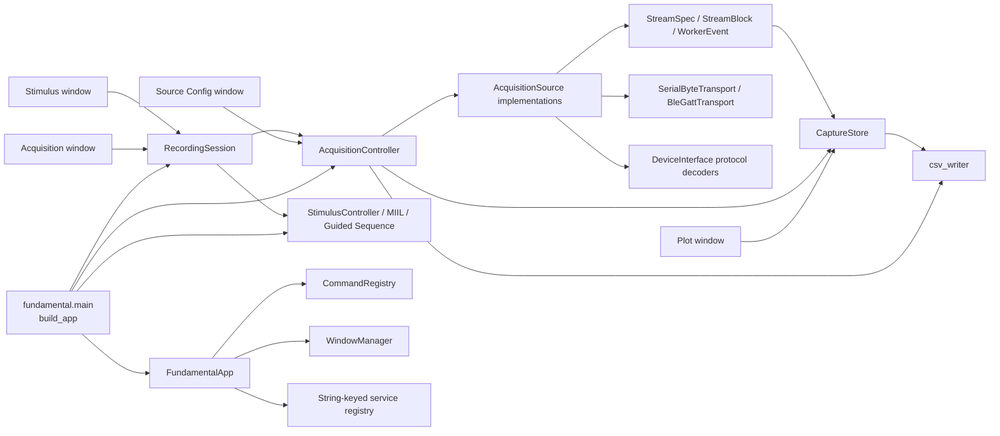
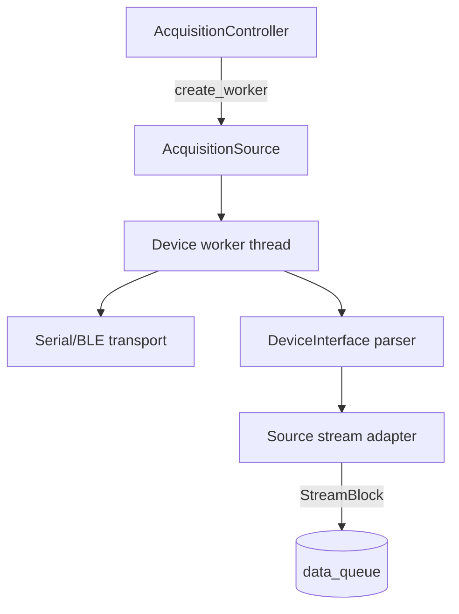

# 02 — Architecture

This page describes the architecture that exists in the repository as of
2026-07-29. It is intended to be useful both for incremental development and
for a future refactor that must preserve current acquisition behavior.

The words **invariant**, **current**, and **candidate** are used deliberately:

- **Invariant** means behavior that downstream code or saved data currently
  relies on and that should be protected by tests before refactoring.
- **Current** describes an implementation choice, not necessarily an ideal
  design.
- **Candidate** is a possible refactoring seam; it is not implemented today.

## System overview

The production application is the `fundamental` package. The executable entry
point is [`fundamental.main`](../../fundamental/main.py#L15), normally launched
with:

```bash
uv run python -m fundamental.main
```

`build_app()` is the composition root. It constructs one application shell,
one acquisition controller, the stimulus models, and one `RecordingSession`;
then it registers the feature windows and callbacks.



The four feature windows have intentionally different dependencies:

| Feature | Primary dependency | Reason |
| --- | --- | --- |
| Source Config | `AcquisitionController` | Edits source/device configuration only while stopped. |
| Acquisition | `RecordingSession` | Start, pause, stop, and save must coordinate annotations too. |
| Stimulus | `RecordingSession` | Uses the same lifecycle and capture boundaries as acquisition. |
| Plot | `CaptureStore` | Display-only consumer; it must not control hardware lifecycle. |

The exact construction is in [`main.py`](../../fundamental/main.py#L15). The
shared services registered at lines 20-24 are a convenience service locator;
the feature registration functions currently receive their stronger typed
dependencies directly.

## Architectural layers and dependency direction

### 1. Shell and feature registration

[`app_shell.py`](../../fundamental/app_shell.py#L27) owns the Dear PyGui context,
frame loop, global key handlers, logs, registered services, and integration
callbacks. [`commands.py`](../../fundamental/commands.py#L43) is independent of
Dear PyGui and provides the command contract. [`window_manager.py`](../../fundamental/window_manager.py#L11)
provides lazy construction and show/hide behavior for registered windows.

Each feature follows the same extension shape:

```python
def register(app, dependency) -> None:
    app.window_manager.register(ManagedWindow(...))
    app.register_command(CommandSpec(...))
    app.register_frame_callback(...)
```

The concrete registrations are:

- source configuration: [`source_config.register`](../../fundamental/source_config.py#L73)
- acquisition controls: [`acquisition_window.register`](../../fundamental/acquisition_window.py#L30)
- plot: [`plot_window.register`](../../fundamental/plot_window.py#L340)
- stimulus: [`stimulus_window.register`](../../fundamental/stimulus_window.py#L120)

Windows are built lazily the first time `WindowManager.show()` is called. Core
commands and the protected Log window are registered by `FundamentalApp`.
Feature commands open windows rather than duplicating lifecycle operations in
the command layer.

**Invariant:** feature UI callbacks delegate lifecycle changes to
`RecordingSession` or configuration changes to `AcquisitionController`. They
must not directly start or stop source workers.

### 2. Recording orchestration

[`RecordingSession`](../../fundamental/recording_session.py#L34) is the
application-level lifecycle coordinator. It owns no hardware handle. Its main
responsibilities are:

- coordinate acquisition with the selected annotation paradigm;
- delay annotation start until the managed-device readiness barrier opens;
- preserve/freeze the annotation configuration used by a capture;
- create exact MIIL boundaries using per-stream row cursors;
- apply Guided Sequence commands to MIIL and fail safe if an effect is not
  accepted;
- compose stimulus resolvers, sidecar rows, and stimulus metadata for saving.

Both the Acquisition and Stimulus windows call this object. That is what makes
`Start`, `Pause`, `Resume`, `Stop`, and `Save` global experiment operations
rather than per-window or per-device operations.

**Invariant:** `AcquisitionController` is the sole owner of source lifecycle;
annotation controllers observe capture position and never open or close a
transport.

### 3. Acquisition supervision

[`AcquisitionController`](../../fundamental/acquisition.py#L47) currently
combines five roles:

1. concrete source catalog and source selection;
2. device/source configuration and validation;
3. worker construction and lifecycle supervision;
4. queue draining, health aggregation, and `CaptureStore` ownership;
5. capture path, metadata, and persistence dispatch.

It starts from one of four concrete source implementations:

- `SerialADS1299Source`
- `BLEW2Source`
- `BWT901Source`
- `MyoSource`

The selected source set exposes one or more `StreamSpec` objects. Source changes
and configuration changes are rejected unless acquisition is `STOPPED`.
Duplicate stream IDs and duplicate active BLE addresses are rejected before a
capture starts.

The controller supports two lifecycle modes:

- **Managed lifecycle:** every selected source advertises
  `supports_managed_lifecycle = True`. W2 and BWT901 use this mode. Workers
  connect first and wait behind one shared capture gate and clock.
- **Legacy lifecycle:** at least one source does not advertise the capability.
  ADS1299 and Myo currently use this mode. Pause stops the worker; Resume creates
  another worker from `CaptureResumeState`.

This capability decision is made in
[`AcquisitionController.start`](../../fundamental/acquisition.py#L334), with the
`all(...)` check at line 365.

### 4. Source, transport, and protocol boundaries

The common contracts live in [`sources/base.py`](../../fundamental/sources/base.py#L17):

- `AcquisitionSource` declares configuration-independent operations needed by
  the controller (`stream_specs`, metadata, inspection text, worker creation).
- `SourceWorker` is the minimal thread-like lifecycle contract.
- `WorkerControl` carries a shared stop event, capture gate, and active-capture
  clock.
- `SourceWorkerGroup` presents several workers as one worker and monitors their
  readiness.

Device adapters live under `fundamental/sources/`. They are responsible for
turning decoded protocol packets into schema-valid `StreamBlock` batches. The
reusable byte transports live in [`transports.py`](../../fundamental/transports.py),
while binary protocol parsing lives in `DeviceInterface/`.



Current examples demonstrate the intended separation:

- W2 serial and W2 BLE share `DeviceInterface.w2_protocol.W2StreamParser` and
  differ only in their transport-facing worker loops
  ([`ble_w2.py`](../../fundamental/sources/ble_w2.py#L261)).
- BWT901 uses `BleGattTransport` plus
  `DeviceInterface.bwt901_protocol.BWT901StreamDecoder`
  ([`bwt901.py`](../../fundamental/sources/bwt901.py#L132)).
- ADS1299 still owns a direct `pyserial` loop rather than the reusable
  `SerialByteTransport` ([`serial_ads1299.py`](../../fundamental/sources/serial_ads1299.py#L52)).
- Myo delegates its device API to `pymyo` and produces separate EMG and IMU
  streams ([`myo.py`](../../fundamental/sources/myo.py#L144)).

**Invariant:** protocol decoders must not import UI, plotting, capture storage,
or experiment semantics. Transport code must not assign stimulus labels.

### 5. Heterogeneous stream contracts

[`streams.py`](../../fundamental/streams.py#L15) is the stable data-plane
contract:

- `FieldSpec` describes one typed numeric column and its display semantics.
- `StreamSpec` describes one independently sampled stream.
- `StreamBlock` is one validated batch from exactly one stream.
- `StreamSnapshot` is an immutable full-capture view for persistence.
- `CaptureResumeState` contains the last accepted cursor for each stream.
- `SeriesSpec` is the scalar plotting view derived from stream fields.

[`CaptureStore`](../../fundamental/capture_store.py#L46) keeps both:

- complete Python lists for saving; and
- bounded `deque` windows for live plotting.

`CaptureStore.append_block()` validates row width, schema stability, and
nondecreasing time independently for each stream. It does not require streams
to have equal row counts or identical timestamps.

**Invariant:** raw streams remain independent and lossless. Acquisition and
saving do not resample, pad, interpolate, or force equal row counts.

The plot window consumes only `SeriesSpec` and recent windows. The CSV writer
consumes only `StreamSnapshot` and schema metadata. Neither contains device
branches. This is the most reusable boundary in the current architecture.

### 6. Persistence

[`csv_writer.default_capture_path`](../../fundamental/csv_writer.py#L17)
allocates one experiment directory per new capture. [`save_capture`](../../fundamental/csv_writer.py#L50)
writes:

- one CSV per populated stream when multiple streams exist;
- one shared `capture.metadata.json`; and
- an optional `capture.stimulus.csv` event/interval sidecar.

CSV column order comes from `StreamSpec`: `time_s`, metadata fields, optional
`stimulus_code`, then signal fields. Stimulus labels are resolved at save time;
the raw rows in `CaptureStore` are not rewritten when the operator changes an
MIIL instruction.

**Invariant:** saved raw values are the source-adapter values. Plot transforms
and robust scaling are view-only and never enter the raw CSV path.

### 7. Annotation models

The annotation side currently contains three separate models:

- [`StimulusController`](../../fundamental/stimulus_model.py#L49): timed,
  duration-driven schedule;
- [`MIILController`](../../fundamental/miil_model.py#L101): manual instruction
  intervals, including code `0` and retroactive code `-1` drop semantics;
- [`GuidedSequenceController`](../../fundamental/guided_sequence.py#L122): pure
  operator-paced plan state machine that emits commands for MIIL.

`GuidedSequenceController` does not mutate MIIL or acquisition directly.
`RecordingSession._apply_guided_command()` applies its requested effects and
performs a full safety stop if the expected MIIL/acquisition postcondition is
not reached.

## Stable dependency rules

The following rules should be retained during incremental work and explicitly
tested before a refactor:

1. `DeviceInterface` parsers are pure protocol concerns.
2. Source workers own device APIs, transport lifetime, parser instances, and
   conversion to `StreamBlock`.
3. Workers communicate with the UI/controller through thread-safe queues and
   events, never by calling Dear PyGui.
4. `CaptureStore` is mutated by the UI/controller thread after queue draining.
5. Plotting and persistence depend on stream schemas, not device identity.
6. `RecordingSession` is the public experiment lifecycle boundary.
7. Acquisition owns hardware; stimulus owns labels; neither crosses that
   ownership boundary.
8. Every capture freezes the annotation plan/codebook that explains its saved
   labels.
9. Multiple raw streams may start, stop, and sample at slightly different
   instants; their row counts are intentionally independent.
10. A required managed-device error is fail-fast for the whole active source
    set.

## Adding a feature without breaking boundaries

### Add another protocol on an existing transport

1. Add a pure decoder under `DeviceInterface/` with parser-level tests.
2. Add a source adapter/worker that uses an existing transport and emits a new
   `StreamSpec`/`StreamBlock`.
3. Add source configuration and metadata.
4. Register it in the current concrete source catalog and Source Config UI.
5. Do not add device-specific branches to plot or CSV code.

### Add another transport for an existing protocol

1. Implement a transport contract in `fundamental/transports.py` or a focused
   sibling module.
2. Reuse the existing protocol parser and stream adapter.
3. Keep connection/configuration fields in the source configuration layer.
4. Verify Pause/Resume semantics explicitly; an open transport and active
   device streaming command are different states.

### Add a new visualization

Consume `CaptureStore.series_specs()` and `get_series_window()`. Use
`signal_kind`, unit, and fixed-range metadata rather than inspecting stream IDs
for known device names. A specialized IMU view may add a higher-level query
adapter, but it must remain read-only with respect to acquisition.

### Add a new annotation paradigm

Keep its state machine independent of Dear PyGui and hardware. Integrate it at
the `RecordingSession` boundary so it can observe capture position and provide
save-time label/metadata resolvers.

## Known architectural limitations

| Priority | Limitation | Consequence |
| --- | --- | --- |
| High | `AcquisitionController` drops worker references after a bounded join without verifying every nested worker stopped. | A hardware call that ignores cancellation could leave an orphan worker able to emit into shared queues. |
| High | Data/event queues are unbounded, while full capture rows are retained in Python objects and saving snapshots copy them to tuples. | A stalled UI or long/high-rate capture can create substantial queue and memory growth. |
| High | CSV/JSON saving runs synchronously on the Dear PyGui thread and is not transactional across files. | A large save freezes the UI; a write error may leave a partially written experiment directory. |
| Medium | `STARTING` has no controller-level deadline and there is no distinct `FAILED` state. | A worker that remains alive but never becomes ready can hold the controller in `STARTING`; failures collapse into `STOPPED` plus `last_error`. |
| Medium | Frame and shutdown callbacks are not isolated from exceptions. | One failing callback can terminate the UI loop; one failing shutdown callback can prevent later cleanup and context destruction. |
| Medium | Managed capability is inferred through an optional class attribute and an `all(...)` check. | Mixing a legacy source with W2/BWT silently downgrades the whole capture to reconnect-on-pause behavior. |
| Medium | `AcquisitionController` imports every concrete source and contains source-specific update/validation methods. | Adding a source requires edits to the central controller and Source Config UI. |
| Medium | `RecordingSession` knows every annotation paradigm, Guided Sequence effects, metadata shapes, and save dispatch. | New paradigms increase conditional complexity in an already large coordinator. |
| Low | UI modules use module-global tags and editor state. | Multiple app/session instances in one process are difficult, and UI state tests require extensive Dear PyGui mocking. |
| Low | Window active order records programmatic `show()` calls rather than true focus changes. | `Esc` closes the most recently opened managed window, which may differ from the visibly focused window. |

## Refactoring seams (not current behavior)

A future refactor should be incremental and preserve the invariants above. A
low-risk order is:

1. **Reliability guardrails first:** isolate frame/shutdown callback failures,
   report queue depth, verify worker termination, and add a startup deadline.
2. **Extract a source registry:** move concrete source construction,
   configuration schema, validation, and capability declaration behind
   descriptors. Keep `AcquisitionController` as supervisor during this step.
3. **Separate capture persistence:** introduce a repository/writer service and
   atomic or chunked output, while retaining the exact current CSV schemas.
4. **Introduce an annotation adapter contract:** let `RecordingSession`
   coordinate a selected adapter rather than branching on each paradigm.
5. **Encapsulate large UI modules:** convert module-global editor state into
   per-window objects without changing the domain controllers.
6. **Only then consider splitting the supervisor:** separate source selection,
   worker supervision, and capture buffering after executable lifecycle tests
   cover the current managed and legacy paths.

Large simultaneous rewrites of source configuration, worker supervision,
annotation, and persistence would erase the existing tested seams and make
hardware regressions difficult to localize.

## Executable architecture references

The following tests are especially useful as contracts during refactoring:

- [`test_acquisition_sources.py`](../../tests/test_acquisition_sources.py#L328):
  managed W2/BWT shared lifecycle and fail-fast behavior.
- [`test_recording_session.py`](../../tests/test_recording_session.py#L354):
  acquisition/MIIL coordination and readiness barrier.
- [`test_recording_session.py`](../../tests/test_recording_session.py#L380):
  independent stream row boundaries and save metadata.
- [`test_capture_store.py`](../../tests/test_capture_store.py): schema-driven
  buffering and resume cursors.
- [`test_app_commands.py`](../../tests/test_app_commands.py): shell command
  registration behavior.
- [`test_app_shell_keyboard.py`](../../tests/test_app_shell_keyboard.py): global
  Enter routing priorities.
