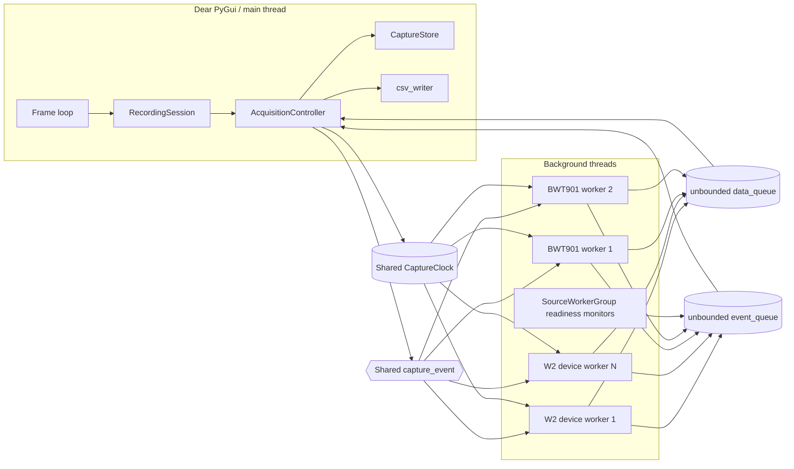
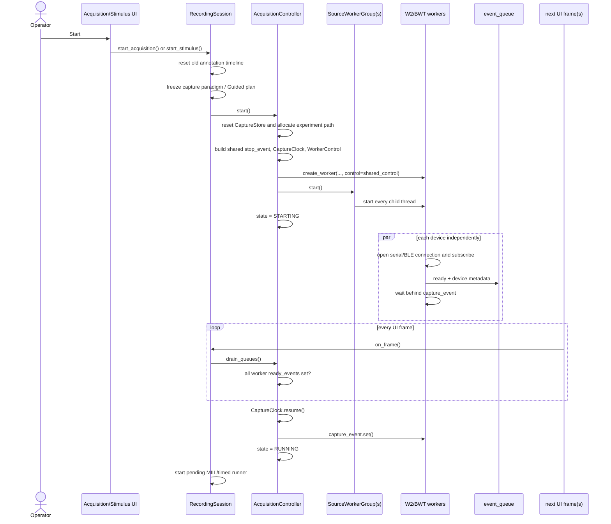

# 03 — Runtime and Capture Lifecycle

This page traces the current runtime behavior from application startup through
connection, capture, annotation, pause/resume, stop, failure, and save. It is a
companion to [Architecture](02-architecture.md).

## Execution model

There is one Dear PyGui/main thread and one or more background device worker
threads.

### Main/UI thread

The main thread owns:

- Dear PyGui calls and window state;
- command execution and global key dispatch;
- `RecordingSession` lifecycle calls;
- `AcquisitionController` state transitions;
- draining worker queues;
- all mutation of `CaptureStore`;
- synchronous CSV/JSON saving.

[`FundamentalApp.run`](../../fundamental/app_shell.py#L91) executes registered
frame callbacks before every Dear PyGui render. Registration order in
[`build_app`](../../fundamental/main.py#L15) currently makes
`RecordingSession.on_frame()` the first feature callback, so incoming events
and blocks are processed before status and plot windows refresh.

### Worker threads

Each physical W2 or BWT901 device owns a worker thread. A W2 source may return a
group of up to five device workers; BWT901 returns a group of up to two. If W2
and BWT901 are active together, `AcquisitionController` wraps the source-level
workers/groups in one outer `SourceWorkerGroup`. The resulting readiness tree
still appears as one `SourceWorker` to the controller.

BLE worker threads create and own their own asyncio event loop with
`asyncio.run()`. Serial workers perform blocking reads with configured
timeouts. Workers never call Dear PyGui or mutate `CaptureStore` directly.

`SourceWorkerGroup` also creates a small daemon readiness-monitor thread. It
sets the group's `ready_event` only after all children are ready.



## Acquisition state machine

The public states are declared by
[`AcquisitionState`](../../fundamental/messages.py#L17): `STOPPED`, `STARTING`,
`RUNNING`, and `PAUSED`.

```mermaid
stateDiagram-v2
    [*] --> STOPPED

    STOPPED --> STARTING: Start; all sources managed
    STOPPED --> RUNNING: Start; legacy lifecycle
    STARTING --> RUNNING: every required worker ready
    STARTING --> STOPPED: error, early worker exit, or Stop

    RUNNING --> PAUSED: Pause
    PAUSED --> RUNNING: Resume

    RUNNING --> STOPPED: Stop or worker error
    PAUSED --> STOPPED: Stop or retained-connection error

    note right of PAUSED
      Managed: connections remain open,
      capture gate closed and clock frozen.
      Legacy: worker was stopped;
      Resume creates a new worker.
    end note
```



There is no separate failed state. A worker error records `last_error`, health,
and capture failure metadata, then the controller stops all workers and becomes
`STOPPED`.

## Application startup and frame order

1. [`main.build_app`](../../fundamental/main.py#L15) constructs controllers and
   the session.
2. It registers `session.on_frame()` first, then Source Config, Acquisition,
   Plot, and Stimulus feature callbacks.
3. [`FundamentalApp.run`](../../fundamental/app_shell.py#L91) creates the Dear
   PyGui context, docking, core windows, key handlers, and viewport.
4. Each frame calls `_run_frame_callbacks()` and then renders.
5. Closing the app enters `finally: shutdown()`. The Acquisition window
   registration installs `controller.shutdown()` as a shutdown callback.

Frame callbacks currently execute without per-callback exception isolation.
This makes callback order and exception behavior part of the practical runtime
contract.

## Start: managed W2/BWT901 capture

The current target experiment (serial/BLE W2 plus BLE BWT901) uses the managed
lifecycle. The complete start path is:



Detailed controller behavior is in
[`AcquisitionController.start`](../../fundamental/acquisition.py#L334) and
[`_advance_starting`](../../fundamental/acquisition.py#L545).

Important details:

- A new capture from `STOPPED` resets all buffered streams and generates a new
  experiment directory/path before hardware readiness is known.
- `CaptureResumeState` is taken before worker construction. For a new capture
  it is empty; for legacy Resume it contains the last rows and timestamps.
- The queues are cleared before new workers start.
- Managed `WorkerControl.capture_event` is initially clear and its clock is
  paused.
- `STARTING` advances only from UI-frame queue draining; readiness does not
  mutate controller state from a worker thread.
- All required workers must be ready. One error or early worker exit stops the
  complete source set.
- MIIL begins at code `0` only after acquisition reaches `RUNNING`; a pending
  annotation runner does not start while devices are still connecting.

### Device behavior when the gate opens

- Serial W2 resets its input buffer/parser and sends the W2 start command.
- BLE W2 resets its parser and sends the W2 start command over the retained
  GATT connection.
- BWT901 is already subscribed; its notification callback begins appending
  decoded frames when `capture_event` is set.

The readiness barrier aligns the active host capture timeline. It does not make
independent devices produce the same number of samples.

## Start: legacy ADS1299/Myo capture

ADS1299 and Myo do not advertise `supports_managed_lifecycle`. The controller
therefore:

1. creates workers without shared `WorkerControl`;
2. starts them immediately; and
3. changes directly to `RUNNING`, with no controller readiness barrier.

Pause stops and joins a legacy worker. Resume calls `start()` again, constructs
a fresh worker, and passes `CaptureResumeState` so its stream continues after
the stored cursor. Device connection setup therefore happens again on Resume.

If a managed source is selected programmatically together with a legacy source,
the `all(...)` capability test makes the entire capture use this legacy branch.
This combination is not the primary UI workflow and has no explicit capability
negotiation message.

## Running frame: events and data

[`RecordingSession.on_frame`](../../fundamental/recording_session.py#L217) is
the central periodic coordinator. Its ordering is:

1. remember whether acquisition and the selected annotation runner were active;
2. call `AcquisitionController.drain_queues()`;
3. start a pending annotation runner if acquisition just became `RUNNING`;
4. update Timed Schedule against `sample_time_s`;
5. auto-stop acquisition when a Timed Schedule completes; or
6. stop/abort annotation if acquisition unexpectedly stopped.

[`AcquisitionController.drain_queues`](../../fundamental/acquisition.py#L497)
does the following:

1. drain **all currently queued events**;
2. merge metadata and health or mark a failure;
3. on any error, stop/join the full worker set and set `STOPPED`;
4. otherwise, advance the readiness barrier if `STARTING`;
5. append at most `max_batches` data blocks (default 64) to `CaptureStore`.

Workers batch up to the configured frame limit before putting a `StreamBlock`
onto `data_queue`. The store validates each block independently. Plot refreshes
later in the same main-thread frame and therefore reads a consistent store
without a lock.

## Pause

The public experiment operation is
[`RecordingSession.pause`](../../fundamental/recording_session.py#L331). It
always pauses acquisition first. Only after acquisition reaches `PAUSED` does
it pause the active annotation runner.

### Managed pause

[`AcquisitionController.pause`](../../fundamental/acquisition.py#L423):

1. clears the shared `capture_event`;
2. pauses the active-capture clock and records its frozen value;
3. drains currently queued blocks;
4. marks non-error device health as paused;
5. sets state to `PAUSED`.

Workers remain alive:

- W2 observes the closed gate, sends its stop-collection command, flushes its
  local batch, and leaves the serial/BLE connection open.
- BWT901 remains subscribed and continues decoding notifications for health,
  but discards decoded packets while the gate is closed.
- MIIL preserves the current action; its elapsed display freezes.

### Legacy pause

The controller sets `stop_event`, joins and removes the worker, drains remaining
blocks/events, and then sets state to `PAUSED`. The transport is closed.

### Current pause-boundary limitation

Managed Pause does not wait for a per-worker "pause acknowledged and local
batch flushed" barrier. The controller drains the queue immediately after
closing the gate, while a worker may flush its last local batch on its next
iteration. Normal UI frames subsequently drain that block, and Guided
"Pause & Save" explicitly runs another frame drain, but an immediate
programmatic `pause(); save()` is not guaranteed to observe every late flush.
Stop is stronger because it joins workers before the final drain.

## Resume

[`RecordingSession.resume`](../../fundamental/recording_session.py#L350) resumes
acquisition first and resumes annotation only if acquisition reaches `RUNNING`.

For managed capture, `AcquisitionController.start()` handles `PAUSED` specially:

1. resume the existing shared clock;
2. set the existing capture gate;
3. change health to `resuming` where no device error exists;
4. set state to `RUNNING` immediately.

W2 workers send their start command again. BWT901 callbacks resume storing
packets. No reconnect or second readiness barrier occurs because the same
connections are retained.

For legacy capture, Resume creates a new worker using stored stream cursors.

Guided Sequence cannot resume after its plan has completed; the operator must
save or stop the experiment. Otherwise the same Guided step and MIIL action are
preserved across Pause/Resume.

## Stop

[`RecordingSession.stop`](../../fundamental/recording_session.py#L371) performs
operations in this order:

1. clear any pending annotation start;
2. call `AcquisitionController.stop()`;
3. close the active timed/MIIL annotation interval at the now-frozen capture
   position;
4. stop the per-capture Guided Sequence runner.

Controller shutdown is implemented by
[`_stop_worker`](../../fundamental/acquisition.py#L588):

1. pause and snapshot the shared clock, when present;
2. set `stop_event`;
3. set `capture_event` to wake any waiting managed worker;
4. join the top-level worker/group with a bounded timeout;
5. clear worker/control references;
6. drain remaining data blocks and events.

W2 sends a final stop command when necessary and closes the transport. BWT901
disconnects. The final store remains available for plotting and saving after
state becomes `STOPPED`.

**Known limitation:** the controller does not verify that every nested worker
is dead after the join timeout before it drops references. A driver call that
does not respond to cancellation could therefore outlive the capture.

## Worker failure and fail-fast behavior

Workers emit a `WorkerEvent(kind="error", ...)` rather than mutating controller
state. At the next UI frame:

1. `_handle_event()` stores `last_error`, per-device error health, and failure
   metadata;
2. `drain_queues()` stops the entire active worker set;
3. acquisition becomes `STOPPED`;
4. `RecordingSession.on_frame()` closes the active annotation and marks Guided
   Sequence aborted.

This is intentionally global: a required W2 or BWT901 disconnect does not leave
the remaining devices recording a silently incomplete experiment.

There is no automatic reconnect or retry. A new Start creates a new capture
directory and resets the old in-memory capture.

## Timing domains

The project intentionally retains several timing sources because the devices
do not expose identical timestamp capabilities.

| Domain | Source/use | Meaning |
| --- | --- | --- |
| Shared active-capture clock | Managed W2/BWT and MIIL operator events | Host monotonic elapsed capture time, frozen during Pause. Starts only after all managed devices are ready. |
| W2 reconstructed stream time | W2 samples | Nominal-rate sample spacing anchored to shared receive time and continued from the stream cursor. |
| BWT901 receive time | Each decoded IMU packet | Shared clock value when the packet is appended; no device sample timestamp is assumed. |
| ADS1299 device-counter time | ADS1299 rows | Derived from frame counter and nominal sample rate. |
| Myo reconstructed time | Myo EMG/IMU rows | Independent nominal-rate streams, with host receive time retained as metadata. |
| `sample_time_s` | Timed Schedule | Maximum latest stored stream time, preserving its historical saved-sample behavior. |

[`AcquisitionController.timeline_time_s`](../../fundamental/acquisition.py#L138)
returns the shared clock for managed capture, including its frozen post-stop
value. For legacy capture it returns the latest stored sample time.
[`RecordingSession.sample_time_s`](../../fundamental/recording_session.py#L124)
always returns `CaptureStore.latest_time_s` for Timed Schedule compatibility.

**Invariant:** Pause removes wall-clock pause duration from the active capture
timeline. A future refactor must not silently replace active-capture time with
wall-clock time.

## MIIL boundary capture

MIIL needs both a human-event time and an exact row boundary for every
independently sampled stream. [`RecordingSession._snapshot_position`](../../fundamental/recording_session.py#L544)
does this:

1. read the shared `timeline_time_s` for the operator event;
2. observe how many data batches are already queued;
3. drain that many batches;
4. snapshot `CaptureStore.stream_row_counts()`.

The event therefore includes blocks already queued when the action was
observed, while blocks arriving afterward are left for a later frame/boundary.
Each `MIILInterval` stores start/end row counts per stream.

At save time, [`MIILController.sample_code`](../../fundamental/miil_model.py#L325)
resolves labels by stream ID and row index whenever complete row boundaries are
available, falling back to time intervals only if they are incomplete.

Consequences:

- W2/IMU files may have different row counts and still receive correct labels.
- No window crosses a stimulus interval merely because another device sampled
  at a different rate.
- Drop changes the effective code of the whole current interval to `-1`; it
  does not rewrite sensor rows in memory.

## Save

The public save path is
[`RecordingSession.save`](../../fundamental/recording_session.py#L444).

### Preconditions

`AcquisitionController.save()` rejects `STARTING` and `RUNNING`. Ordinary
captures must be paused or stopped. An active Guided Sequence is a special
checkpoint operation: `RecordingSession.save()` first pauses all channels and
annotation, drains another frame, then saves and remains paused.

### Save routing

- no active capture paradigm: raw stream snapshots only;
- Timed Schedule: time-based `stimulus_code` resolver plus schedule sidecar and
  frozen schedule metadata;
- MIIL: per-stream/per-row resolver plus interval sidecar and MIIL/Guided
  metadata.

### Files

[`csv_writer.save_capture`](../../fundamental/csv_writer.py#L50) takes immutable
snapshots from `CaptureStore` and writes each independent populated stream.
For example:

```text
captures/experiment_YYYYMMDD_HHMMSS_mmm_xxxxxx/
  capture.ble_w2_w2_1_signal.csv
  capture.ble_w2_w2_2_signal.csv
  capture.bwt901_imu_1_imu.csv
  capture.metadata.json
  capture.stimulus.csv          # when annotations are active
```

Files are not resampled or padded. Different row counts are expected. The
metadata sidecar records each stream schema, row count, filename, source
configuration, runtime/device health, and optional annotation metadata.

### Current persistence limitations

- Saving is synchronous on the UI thread.
- `snapshots()` copies the complete capture lists to tuples before writing,
  increasing peak memory.
- Output is not transactional: multiple stream CSVs and metadata are written
  directly, so a mid-save exception may leave partial files.
- Raw capture stays fully in memory until save; there is no chunked continuous
  writer or recovery journal.
- A directory is allocated at Start, so a failed/cancelled connection attempt
  can leave an empty experiment directory.

## Shutdown

Closing the viewport reaches [`FundamentalApp.shutdown`](../../fundamental/app_shell.py#L114).
The Acquisition feature registered `AcquisitionController.shutdown()`, which
sets the worker stop event, joins, drains, and marks the controller stopped.
Dear PyGui context destruction follows callbacks.

Shutdown callbacks are currently called without `try/finally` isolation. If
one callback raises, later callbacks and `dpg.destroy_context()` may not run.
This is a reliability improvement candidate, not current behavior.

## Runtime invariants checklist

Protect these behaviors with tests when changing lifecycle code:

- [ ] Source and device configuration changes are accepted only when stopped.
- [ ] Managed sources do not append samples until all required devices are
      ready and the shared gate opens.
- [ ] One required-device error stops the complete source set.
- [ ] Managed Pause freezes the clock and retains transport connections.
- [ ] Managed Resume reuses those connections and preserves the current MIIL
      action/Guided step.
- [ ] Stop joins workers, drains final batches, and leaves the buffer saveable.
- [ ] Pause duration is absent from active-capture timestamps.
- [ ] Each stream remains monotonic independently; equal row counts are not
      required.
- [ ] MIIL labels use per-stream row boundaries when available.
- [ ] Plot processing never changes saved raw samples.
- [ ] Save emits source configuration, schema, row counts, health/failure, and
      annotation metadata needed to interpret every CSV.
- [ ] A new Start from stopped clears stale capture labels and allocates a new
      experiment path.

## Executable lifecycle references

- [`test_acquisition_sources.py`](../../tests/test_acquisition_sources.py#L328):
  managed connect/start/pause/resume/stop across W2 and BWT901.
- [`test_acquisition_sources.py`](../../tests/test_acquisition_sources.py#L361):
  shared timeline freezes on Pause and remains readable after Stop.
- [`test_acquisition_sources.py`](../../tests/test_acquisition_sources.py#L383):
  one managed-source error stops all sources.
- [`test_recording_session.py`](../../tests/test_recording_session.py#L466):
  MIIL waits for the managed readiness barrier.
- [`test_recording_session.py`](../../tests/test_recording_session.py#L418):
  MIIL boundary drains only already queued packets.
- [`test_recording_session.py`](../../tests/test_recording_session.py#L578):
  acquisition failure stops active annotation.
- [`test_recording_session.py`](../../tests/test_recording_session.py#L299):
  Guided checkpoint save pauses and resumes the same step.
- [`test_recording_session.py`](../../tests/test_recording_session.py#L611):
  Timed Schedule completion stops acquisition.
