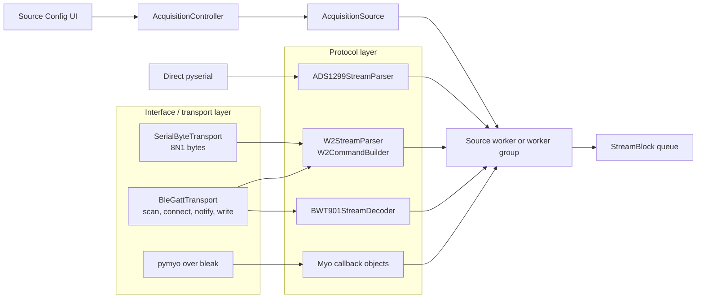

# 04 — Devices, Transports, Protocols, and Sources

This page documents the hardware-facing half of the application. It is intended
both as a maintenance reference and as a map of the seams that should be kept
when the project is refactored.

The most important design rule is that a connection interface and a device
protocol are different concerns:

- a **transport** moves bytes and owns connection resources;
- a **protocol** turns bytes into commands or validated device packets;
- a **source** combines a protocol with one or more transports and publishes the
  application's generic stream contract;
- `AcquisitionController` coordinates sources, not serial ports or BLE
  characteristics directly.

This separation is complete for W2 and BWT901, partial for ADS1299, and delegated
to `pymyo` for Myo.

## Layer map



| Layer | Stable responsibility | Current implementation |
| --- | --- | --- |
| Transport | Open/close an interface, move bytes, report disconnect | [`fundamental/transports.py`](../../fundamental/transports.py) |
| Protocol | Parse/build device frames without GUI or acquisition dependencies | [`DeviceInterface/`](../../DeviceInterface) |
| Source | Configuration, schemas, worker construction, capture metadata | [`fundamental/sources/`](../../fundamental/sources) |
| Orchestration | Source selection, readiness barrier, lifecycle, queues, fail-fast policy | [`fundamental/acquisition.py`](../../fundamental/acquisition.py) |
| Configuration UI | Edit supported source settings while stopped | [`fundamental/source_config.py`](../../fundamental/source_config.py) |

## Common source and worker contracts

The contracts live in
[`fundamental/sources/base.py`](../../fundamental/sources/base.py).

### `AcquisitionSource`

Each source exposes:

```python
name: str
display_name: str
display_text() -> str
inspect_data() -> tuple[str, ...]
stream_specs() -> tuple[StreamSpec, ...]
capture_metadata() -> dict[str, Any]
create_worker(data_queue, event_queue, stop_event, resume_state) -> SourceWorker
```

`stream_specs()` is the boundary seen by plotting and persistence. A downstream
consumer should not import a W2, BWT901, ADS1299, or Myo parser.

### `SourceWorker`

A worker is thread-like and owns the resource it opens. It publishes:

- `StreamBlock` objects to `data_queue`;
- `WorkerEvent` objects to `event_queue`;
- termination through a shared `stop_event`.

`WorkerEvent.kind` is one of `log`, `error`, `metadata`, `ready`, or `health`.
W2 health IDs are `ble_w2.<device_id>` and BWT901 health IDs are
`bwt901.<device_id>`.

### Managed workers

W2 and BWT901 set `supports_managed_lifecycle = True`. Their workers also expose
a `ready_event` and accept a shared `WorkerControl` containing:

- `stop_event`: terminate and release resources;
- `capture_event`: gate sample publication while keeping resources connected;
- `CaptureClock`: one pause-aware logical clock shared by every managed worker.

`SourceWorkerGroup` makes several physical workers look like one worker. Its
group `ready_event` is set only after every child is ready. This is how five W2
ports or two BWT901 connections remain one logical source.

The managed `control=` argument is currently an extension to the nominal
`AcquisitionSource` protocol and is invoked with a type-ignore in
`AcquisitionController`. A future cleanup should make this capability explicit
instead of relying on `supports_managed_lifecycle` plus a wider method
signature.

## Reusable transports

### Serial byte transport

`SerialByteConfig` and `SerialByteTransport` are in
[`fundamental/transports.py`](../../fundamental/transports.py).

- Configuration is normalized to a stripped port, baud rate of at least 1, and
  timeout of at least 1 ms.
- `open()` always configures 8 data bits, no parity, and 1 stop bit.
- The API is deliberately protocol-free: `open`, `read`, `write`,
  `reset_input_buffer`, and `close`.
- A backend can be injected, which keeps worker tests independent of hardware.

W2 Serial uses this transport. ADS1299 still opens `serial.Serial` directly in
its worker; moving ADS1299 to `SerialByteTransport` is a valid future refactor
that should not alter its parser or stream schema.

### BLE GATT transport

`BleGattConfig` and `BleGattTransport` are also in
[`fundamental/transports.py`](../../fundamental/transports.py).

- A target may be selected by explicit address or by a name substring.
- The transport scans and connects while the scanner is active, matching the
  verified BWT901 demo behavior.
- On Windows it can try the default, random, and public address interpretations
  when no address type was configured.
- It tracks active notification UUIDs so disconnect can stop all subscriptions.
- It exposes a thread event for asynchronous disconnect detection.
- Scanner, client factory, and not-found exception types are injectable.

Each BLE worker owns its own event loop. A process-wide lock serializes BLE
scan/connect operations because concurrent Windows scans from independent
loops are unreliable. Consequently, startup of many BLE devices is deliberately
serialized and can take the sum of their scan/connect times. The acquisition
readiness barrier opens only after all required connections complete.

W2 and BWT901 reuse this transport. Myo does not: its connection lifecycle is
owned by `pymyo`.

## Current device inventory and defaults

These are code defaults, not a promise that a port or address is valid on every
host. Change W2's initially displayed rows in `DEFAULT_W2_DEVICES`; change the
other defaults in the named configuration dataclasses/constants.

| Source ID | Device | Interface | Current default target | Maximum | Managed lifecycle |
| --- | --- | --- | --- | ---: | --- |
| `serial_ads1299` | ADS1299 host stream | Serial | `COM5`, 921600 baud, 0.05 s | 1 | No |
| `ble_w2` | RunE W2 | Serial or BLE per device | Five serial rows: `COM9`, `COM11`, `COM12`, `COM13`, `COM10` | 5 | Yes |
| `bwt901_ble` | BWT901BLE IMU | BLE | `E9:34:17:08:9F:4A`, name `WT901BLE67` | 2 | Yes |
| `ble_myo` | Myo armband | BLE through `pymyo` | address empty, name filter `Myo` | 1 | No |

The controller itself starts with `serial_ads1299` selected. In Source Config,
choosing W2 preselects "Acquire BWT901 simultaneously". The UI otherwise offers
ADS1299, BWT901, and Myo as single-primary-source configurations. The controller
can represent a tuple of sources, but only the W2+BWT901 combination has a
first-class multi-source editor and fully shared managed lifecycle.

## ADS1299

### Protocol

The pure parser is
[`DeviceInterface/ads1299_protocol.py`](../../DeviceInterface/ads1299_protocol.py),
with the wire format described in
[`DeviceInterface/EMG_HOST_FRAME_PROTOCOL.md`](../../DeviceInterface/EMG_HOST_FRAME_PROTOCOL.md).

- Current frames are 35 bytes; legacy frames without an explicit active-channel
  count are 34 bytes.
- Boundary bytes are `0xAA` and `0xBB`.
- Eight signed 24-bit big-endian channel codes are decoded.
- The current format carries `emg_channel_count` from 1 through 8.
- An unsigned 64-bit counter supplies continuity and timestamp information.
- The parser reports skipped bytes, bad tails, bad channel counts, current versus
  legacy frame counts, and `dropped_frames_before`.
- Counter regression is represented by `dropped_frames_before = -1`, because the
  loss size cannot be inferred.

The parser has no serial or GUI dependency.

### Source and worker

Implementation:
[`fundamental/sources/serial_ads1299.py`](../../fundamental/sources/serial_ads1299.py).

- `SerialADS1299Source` publishes one stream: `serial_ads1299.emg`.
- Configuration comes from `SerialConfig`: `COM5`, 921600 baud, 0.05 s timeout.
- The worker currently opens pyserial directly as 8N1.
- It batches at most 64 decoded rows per `StreamBlock` and emits diagnostics when
  bytes arrive but frames do not decode.
- It is a legacy source: Pause closes the worker/port, and Resume creates a new
  worker. Counter-aware resume keeps the logical sample timeline continuous.

ADS1299 schema and timestamp details are documented in
[Streams, Timing, Buffering, and Persistence](05-streams-timing-storage.md).

## RunE W2

### Configuration

Implementation:
[`fundamental/sources/ble_w2.py`](../../fundamental/sources/ble_w2.py).

Shared protocol settings apply to every configured W2:

| Setting | Current value |
| --- | --- |
| Mode | `emg_raw` |
| Configured rate | 1000 Hz |
| Serial baud | 256000 |
| Serial timeout | 0.05 s |
| BLE scan timeout | 5 s |
| BLE notify UUID | `0000FFF4-0000-1000-8000-00805F9B34FB` |
| BLE write UUID | `0000FFF3-0000-1000-8000-00805F9B34FB` |
| Supported modes | `emg_raw`, `emg_rms`, `eeg_raw` |

Each `W2DeviceConfig` independently selects `serial` or `ble` and supplies a
stable `device_id` plus its port, address, or name filter. The current initial
rows are:

| Device ID | Interface | Port | BLE name filter retained in the row |
| --- | --- | --- | --- |
| `w2_1` | Serial | `COM9` | `RunE W21` |
| `w2_2` | Serial | `COM11` | `RunE W22` |
| `w2_3` | Serial | `COM12` | `RunE W23` |
| `w2_4` | Serial | `COM13` | `RunE W24` |
| `w2_5` | Serial | `COM10` | `RunE W25` |

Validation requires non-empty unique device IDs, unique serial ports, and
unique explicit BLE addresses. If more than one W2 uses BLE, every BLE row must
have an explicit address. All active BLE addresses must also be unique across
W2 and BWT901.

`W2Config.transport`, `serial_devices`, and `W2BLEConfig` remain compatibility
paths from the earlier single-interface design. New code should use explicit
`devices`. The class name `BLEW2Source` is likewise historical: it now supports
both Serial and BLE.

### Protocol and interface reuse

The unchanged protocol is
[`DeviceInterface/w2_protocol.py`](../../DeviceInterface/w2_protocol.py).

- `W2CommandBuilder` creates start/stop/read command frames.
- `W2StreamParser` incrementally resynchronizes notification frames and tracks
  checksum, tail, payload, skipped-byte, and unsupported-frame counters.
- Raw packets carry one little-endian float followed by signed 16-bit deltas.
  EMG deltas use factor 3.1457 and EEG deltas use factor 12.5786.
- RMS packets carry one integer RMS value.
- The protocol contains no sample counter or device timestamp.

Both `SerialW2Worker` and `BLEW2Worker` feed their received bytes to exactly the
same parser and `W2StreamAdapter`. Interface choice therefore does not change
stream identity or protocol semantics.

### Lifecycle

- Every W2 has one worker and one stream `ble_w2.<device_id>.signal`.
- All W2 workers share `WorkerControl` when launched by the managed controller.
- Serial opens the port before declaring ready; BLE connects and subscribes
  before declaring ready.
- Start sends the configured W2 collection command only after the shared capture
  gate opens.
- Pause sends W2 stop, flushes accumulated rows, and keeps the serial port or BLE
  connection open.
- Resume clears a partial parser frame, restarts collection, and reuses the same
  connection.
- Stop sends stop where possible, flushes, then closes/disconnects.

Health reports decoded **packets**, parser errors, skipped bytes, and last-packet
age. `observed_rate_hz` is packets divided by active capture time, not necessarily
sample rows per second: one raw W2 packet can expand to multiple samples.

## BWT901BLE

### Configuration

Implementation:
[`fundamental/sources/bwt901.py`](../../fundamental/sources/bwt901.py).

| Setting | Current value |
| --- | --- |
| Default address | `E9:34:17:08:9F:4A` |
| Name filter | `WT901BLE67` |
| Service UUID | `0000ffe5-0000-1000-8000-00805f9a34fb` |
| Notify UUID | `0000ffe4-0000-1000-8000-00805f9a34fb` |
| Write UUID | `0000ffe9-0000-1000-8000-00805f9a34fb` |
| Scan timeout | 10 s |
| Maximum devices | 2 |

Each row has a unique `device_id` and address. Two-device operation requires an
explicit address for both rows. `windows_address_type` exists in the model but
is not currently exposed in Source Config.

The service and write UUIDs are captured as configuration, but the current
worker only connects and subscribes to the notify UUID; it does not send a BWT
configuration/start command. The device must already be producing the realtime
frame used by the verified demo.

### Protocol

The pure decoder is
[`DeviceInterface/bwt901_protocol.py`](../../DeviceInterface/bwt901_protocol.py).

- A realtime frame is 20 bytes: `0x55 0x61` followed by nine little-endian
  signed 16-bit values.
- It handles split, merged, and misaligned input and retains a split header byte.
- Acceleration is `raw / 32768 * 16 g`.
- Angular velocity is `raw / 32768 * 2000 deg/s`.
- Angle is `raw / 32768 * 180 deg`.
- Values are rounded to three decimals in the decoder, matching the demo.
- `sequence` is generated by this host decoder; it is not a device counter.
- The current frame has no validated checksum in this implementation.

The packet retains the nine raw integers internally, but the current
`StreamSpec` and CSV preserve only sequence plus the nine scaled values. If
future work requires recalibration, high-precision integration, or a different
rounding policy, add raw fields compatibly rather than replacing the existing
physical-value columns.

### Lifecycle

- Each device publishes `bwt901.<device_id>.imu`.
- The source returns a `SourceWorkerGroup`, including for one configured device.
- Connection and notification subscription complete before `ready_event`.
- During Pause, BLE remains connected and the decoder continues consuming
  notifications, but rows are not appended. Host-generated sequence gaps in the
  saved stream are therefore expected across pauses.
- Every stored row receives the shared capture clock value at notification
  handling time. No nominal output rate is assumed.
- A disconnect emits an error; the controller then stops all active sources.

## Myo armband

Implementation:
[`fundamental/sources/myo.py`](../../fundamental/sources/myo.py).

`MyoSource` intentionally delegates both BLE transport and Myo protocol details
to `pymyo`:

- default address is empty and discovery uses Myo's control-service UUID or the
  `Myo` name filter;
- scan timeout is 10 s and connect timeout is 20 s;
- EMG and IMU can be independently enabled; at least one is required;
- raw EMG nominal rate is 200 Hz and IMU nominal rate is 50 Hz;
- connection metadata includes name, battery, firmware, hardware revision,
  serial number, BLE identifier, and `pymyo` version where available;
- cleanup disables streams, restores normal sleep mode, and disconnects.

Myo is a legacy, single-source lifecycle path. Acquisition state becomes
Running before BLE discovery has an all-device ready barrier. Pause stops and
disconnects the worker; Resume reconnects and continues each stream from its
own last sample. If Myo is refactored into the managed path, preserve its two
independent stream schemas and host receive audit column.

## Source selection and validation policy

`AcquisitionController` owns a hard-coded dictionary containing the four
production source classes. Source changes and configuration edits are rejected
unless acquisition is Stopped.

Selection performs these generic checks:

1. at least one known source;
2. unique source names after de-duplication;
3. unique `stream_id` values across all selected sources;
4. unique explicit BLE addresses across W2 and BWT901.

Configuration performs device-specific checks in the controller. A successful
change to an active source reconfigures `CaptureStore` with `clear=True`.
Therefore the safe operator/developer sequence is **Stop, Save, then Apply a new
source configuration**. Starting a new stopped capture also resets the store.

Only a set in which every source advertises managed lifecycle receives a shared
readiness barrier and clock. Combining a managed and a legacy source through
direct controller calls falls back to the legacy lifecycle; it is not a tested
hardware configuration and is not offered by the UI.

## Adding a new device or interface

### Add a protocol over an existing interface

1. Add a pure parser/command module under `DeviceInterface/`. It must not import
   Dear PyGui, acquisition, pyserial, or bleak.
2. Add parser tests for split frames, merged frames, corruption/resynchronization,
   scaling, counters, and command bytes as applicable.
3. Define a source configuration and immutable `StreamSpec` objects in
   `fundamental/sources/<device>.py`.
4. Reuse `SerialByteTransport` or `BleGattTransport` in the worker. Keep protocol
   packets independent of host timing; add timestamps when adapting packets to
   `StreamBlock`.
5. Implement `AcquisitionSource` methods and capture enough configuration in
   `capture_metadata()` to reproduce interpretation of the saved files.
6. Decide explicitly whether Pause must keep the connection open. If yes, use
   managed lifecycle, `ready_event`, and the shared `WorkerControl`.
7. Register the source in `AcquisitionController`, exports, Source Config labels,
   Apply/sync logic, and any device-specific validation.
8. Test schemas, resume behavior, failure handling, persistence, and interaction
   with every supported simultaneous source.

Plot and CSV code should require no device-specific branch if the `FieldSpec`
roles, units, signal kinds, and plot hints are correct.

### Add a new interface for an existing protocol

1. Keep the existing protocol parser unchanged.
2. Implement a byte transport with explicit open/connect, read or notification,
   write where needed, close/disconnect, and injectable test backend.
3. Add a worker or worker strategy that feeds bytes into the same parser and
   adapter.
4. Keep the device's `stream_id` independent of interface choice.
5. Add the interface selector and connection fields to the device configuration
   and validate unique resource targets.
6. Prove with tests that both interfaces produce equivalent `StreamBlock`
   schemas and protocol values.

W2 is the reference implementation of this pattern.

## Refactoring seams and known debt

- Source registration, typed controller properties, configuration update
  methods, validation, and Source Config UI branches are hard-coded. A small
  source registry plus source-owned configuration view models could remove this
  repetition without changing stream or acquisition behavior.
- The managed lifecycle capability is implicit rather than a typed protocol.
- ADS1299 bypasses the reusable serial transport.
- Myo combines transport and protocol behind an external library and has no
  readiness or health contract.
- `BLEW2Source` and `W2BLEConfig` names no longer describe the W2 feature; retain
  aliases for compatibility if names are cleaned up.
- BWT service/write configuration is presently unused by the worker.
- BLE connect serialization improves Windows reliability but increases startup
  time; do not remove it without multi-adapter/multi-device tests.
- Device defaults are experiment-specific. When they change, update source
  constants, the fundamental README, Source Config expectations, and default
  tests together.

## Test map

| Concern | Primary tests |
| --- | --- |
| Reusable BLE scan/connect behavior | [`tests/test_transports.py`](../../tests/test_transports.py) |
| ADS1299 parsing, continuity, timestamps, CSV | [`tests/test_ads1299_protocol.py`](../../tests/test_ads1299_protocol.py) |
| W2 commands/parser, Serial/BLE equivalence, pause reuse, health | [`tests/test_ble_w2_source.py`](../../tests/test_ble_w2_source.py) |
| BWT decoder, two-device streams, shared clock and pause gate | [`tests/test_bwt901_source.py`](../../tests/test_bwt901_source.py) |
| Myo independent streams, nominal reconstruction, resume, cleanup | [`tests/test_myo_source.py`](../../tests/test_myo_source.py) |
| Source validation, mixed W2 interfaces, managed barrier/fail-fast | [`tests/test_acquisition_sources.py`](../../tests/test_acquisition_sources.py) |

When a default device row is changed, run the full suite: default assertions are
intended to detect documentation/configuration drift, not only parser regressions.
