# 05 — Streams, Timing, Buffering, and Persistence

This page documents the data contract after a hardware-specific worker has
decoded a packet. It explains how independently sampled streams share a capture
session without being forced into an artificial rectangular matrix.

The central rule is:

> Preserve every source's received rows and timestamps as an independent raw
> stream. Synchronization, interpolation, trimming, and fused tables are
> explicit downstream transformations.

## End-to-end data path

```mermaid
flowchart LR
    subgraph WorkerThreads[Device worker threads / BLE event loops]
        BYTES[Serial bytes or BLE notifications]
        PARSER[Protocol parser / decoder]
        ADAPTER[Timestamp and row adapter]
        BYTES --> PARSER --> ADAPTER
    end

    ADAPTER -->|StreamBlock| DQ[(data_queue)]
    WorkerThreads -->|WorkerEvent| EQ[(event_queue)]

    DQ --> DRAIN[AcquisitionController.drain_queues]
    EQ --> EVENTS[health, metadata, fail-fast]
    DRAIN --> STORE[CaptureStore]

    STORE --> FULL["Full per-stream rows<br/>in memory"]
    STORE --> WINDOW[Bounded per-series windows]
    WINDOW --> PLOT[Generic Plot]

    FULL --> SNAP[StreamSnapshot]
    SNAP --> SESSION["RecordingSession<br/>optional label resolver"]
    SESSION --> WRITER[Schema-driven CSV writer]
    EVENTS --> META[Capture metadata]
    WRITER --> CSV[One CSV per populated stream]
    WRITER --> METAJSON[capture.metadata.json]
    WRITER --> STIM[capture.stimulus.csv]
```



There are two independent queues:

- `data_queue` carries only schema-validated `StreamBlock` batches;
- `event_queue` carries logs, readiness, health, runtime metadata, and errors.

An error event invokes the controller's fail-fast policy: all workers are
stopped, queued data/events are drained, and acquisition becomes Stopped.

## Schema contracts

The immutable contracts are in
[`fundamental/streams.py`](../../fundamental/streams.py).

### `FieldSpec`

| Property | Meaning |
| --- | --- |
| `key` | Stable machine column name; unique inside a stream |
| `label` | Human-readable plot/UI label |
| `unit` | Display and metadata unit |
| `role` | `metadata` or `signal` |
| `signal_kind` | `emg`, `eeg`, `quaternion`, `acceleration`, `angular_velocity`, or `generic` |
| `plottable` | Whether `CaptureStore` exposes a series |
| `default_plot` | Whether the plot window initially selects it |
| `fixed_range` | Optional physical/display range |
| `csv_decimals` | Optional field-specific export precision |

Metadata fields cannot be plottable. `signal_kind` is deliberately a small plot
hint, not a device type.

### `StreamSpec`

A `StreamSpec` defines one independently sampled table:

- stable `stream_id` and display name;
- nominal sample rate, or `None` when it is not asserted;
- ordered fields;
- a text description of the time source;
- optional `active_signal_count_key` for variable active-channel counts.

The spec validates non-empty IDs, non-empty fields, unique field keys, valid
active-count references, and positive nominal rates. It does not require a
globally registered device type.

### `StreamBlock`

A `StreamBlock` is one batch from exactly one stream. It contains the exact
`StreamSpec`, a tuple of `time_s` values, and rows matching the field width.
Construction rejects mismatched timestamp/row counts and wrong row widths.

### Read and persistence views

- `SeriesSpec` identifies one plottable scalar as
  `<stream_id>/<field_key>`.
- `SeriesWindow` is a recent time/value slice for live display.
- `StreamSnapshot` is an immutable full-capture view for persistence.
- `StreamCursor` records the last accepted row, timestamp, and row count for
  resume.
- `CaptureResumeState` contains every available cursor plus the maximum stored
  time across streams.

## Production stream catalog

`time_s` is written by the generic CSV writer before the declared fields.

| Stream | Nominal rate | Metadata fields | Signal fields | Time source |
| --- | ---: | --- | --- | --- |
| `serial_ads1299.emg` | 1000 Hz | `frame_counter`, `dropped_frames_before`, `emg_channel_count` | `ch1_code` ... `ch8_code` | Device frame counter at nominal rate |
| `ble_w2.<device_id>.signal` | Configured, currently 1000 Hz | none | `value` | Configured-rate reconstruction anchored to shared host time |
| `bwt901.<device_id>.imu` | unknown (`None`) | `sequence` | `acc_x_g`, `acc_y_g`, `acc_z_g`, `gyro_x_dps`, `gyro_y_dps`, `gyro_z_dps`, `angle_x_deg`, `angle_y_deg`, `angle_z_deg` | Shared host receive time excluding pauses |
| `myo.emg` | 200 Hz | `host_rx_time_s` | `emg_ch1_code` ... `emg_ch8_code` | Nominal-rate reconstruction plus host audit |
| `myo.imu` | 50 Hz | `host_rx_time_s` | quaternion W/X/Y/Z, acceleration X/Y/Z, gyroscope X/Y/Z | Nominal-rate reconstruction plus host audit |

ADS1299 always stores eight channel codes, while `emg_channel_count` identifies
the active prefix. `CaptureStore` uses `active_signal_count_key` to hide inactive
channels from live series consumers without destroying their raw columns.

W2 mode determines the series signal kind:

- `emg_raw` -> `emg`;
- `eeg_raw` -> `eeg`;
- `emg_rms` -> `generic` because the device has already supplied one RMS value.

BWT901 angle fields currently use the generic signal kind. All non-EMG series
offer only the Raw plot view. EMG additionally offers Raw, Rectified, RMS, and
Envelope views. Plot processing and display downsampling never modify full rows
or saved CSV values.

## Time model

There is no single timestamp algorithm suitable for every device. The source
declares its algorithm in `StreamSpec.time_source` and records explanatory
metadata where necessary.

### Shared managed capture clock

[`CaptureClock`](../../fundamental/sources/base.py) is a thread-safe logical
clock based on `time.monotonic()`:

1. before all managed workers are ready, it is stopped at zero;
2. after the readiness barrier, `resume()` starts it;
3. Pause accumulates elapsed active time and freezes it;
4. Resume continues from the frozen value;
5. Stop preserves the last value in `AcquisitionController.timeline_time_s`.

W2 and BWT901 receive the same `CaptureClock` through `WorkerControl`. This gives
them a common active-time origin and excludes wall-clock Pause duration. It does
not synchronize hardware oscillators, transport latency, or command execution.

### ADS1299 timestamps

ADS1299 derives time from its device frame counter and the fixed 1000 Hz protocol
rate. The first frame establishes an origin. During Resume, a new worker starts
the next stored timestamp one sample after the previous cursor even when the
device counter advanced during Pause. The counter discontinuity remains visible
in `dropped_frames_before`; paused wall time is not inserted into `time_s`.

If a counter regresses, the worker starts a new monotonic segment one sample
after the last stored time.

### W2 timestamps

W2 has neither a device counter nor a sample timestamp. `W2StreamAdapter`:

1. decodes all values in the first accepted packet;
2. anchors the packet's last value to the current shared capture time, backing
   up by `(value_count - 1) / configured_rate` for the first value;
3. assigns all later values a continuous `1 / configured_rate` interval;
4. on Resume, continues one interval after that stream's stored cursor.

Each W2 has an independent adapter. Their first packets share the same logical
clock but arrive at different times. Thereafter their timelines follow the
configured 1000 Hz independently and can drift relative to each other and the
host clock. The implementation does not periodically re-anchor them.

### BWT901 timestamps

BWT901 declares no nominal rate and the verified realtime frame contains no
device timestamp. Every accepted frame receives `CaptureClock.now()` at the
host notification callback. This preserves observed arrival timing, including
BLE/OS scheduling jitter.

The stored `sequence` is a host-decoder sequence, not a device-native counter.
The decoder still advances it while paused, although publication is gated, so a
saved sequence gap across Pause is expected.

### Myo timestamps

Myo does not use the managed `CaptureClock` path. Its worker records:

- `host_rx_time_s`: `perf_counter_ns()` relative to the connection's host origin,
  offset by the previous capture's maximum stored time on Resume;
- `time_s`: independently reconstructed at 200 Hz for EMG and 50 Hz for IMU.

The two EMG samples delivered in one notification share one host receive time
but receive consecutive reconstructed sample times. Resume continues each Myo
stream one nominal interval after its own cursor.

## Lifecycle and readiness sequence

### Managed W2/BWT901 session

```mermaid
sequenceDiagram
    participant UI as RecordingSession/UI
    participant AC as AcquisitionController
    participant W as W2/BWT workers
    participant C as Shared WorkerControl
    participant S as CaptureStore

    UI->>AC: Start
    AC->>S: reset active schemas
    AC->>W: create and start all workers
    W->>W: open ports / scan / connect / subscribe
    W-->>AC: ready_event per required worker
    AC->>C: clock.resume(); capture_event.set()
    W-->>S: StreamBlocks via queue
    UI->>AC: Pause
    AC->>C: capture_event.clear(); clock.pause()
    AC->>S: drain queued blocks
    Note over W: W2 sends stop but remains connected
    Note over W: BWT remains subscribed and discards rows
    UI->>AC: Resume
    AC->>C: clock.resume(); capture_event.set()
    UI->>AC: Stop
    AC->>C: clock.pause(); stop_event.set()
    AC->>W: join, close, disconnect, final flush
    AC->>S: drain final blocks/events
```

If a worker exits before the readiness barrier or emits an error later, the
whole source set is stopped. This is a required-device fail-fast policy.

### Legacy ADS1299/Myo session

Legacy sources have no shared ready gate. The controller enters Running as soon
as the worker thread starts. Pause stops and joins the worker, closing the port
or BLE connection. Resume creates a new worker from `CaptureResumeState`.

Do not infer identical Pause cost or connection behavior across managed and
legacy sources.

## Synchronization guarantees and limits

The current design provides coordinated lifecycle and a common logical time
basis, not hardware synchronization.

It guarantees:

- all required managed devices are connected/ready before the capture gate;
- one Start/Pause/Resume/Stop action for the active source set;
- a pause-free shared logical clock for managed sources;
- monotonic timestamps inside each accepted stream;
- independent preservation of actual received rows;
- fail-fast stop after a required worker error.

It does **not** guarantee:

- simultaneous command execution or identical first hardware samples;
- a shared physical sampling clock across W2 devices;
- equal stream lengths or equal end times;
- detection of every lost W2 packet, because W2 has no counter;
- periodic correction of W2 nominal-rate drift;
- device timestamps for BWT901 or Myo;
- millisecond phase alignment, a hardware trigger, or onset accuracy.

Never concatenate multi-device CSVs by row number. For derived multichannel
data, choose a common `time_s` coverage interval and an explicit target grid,
then record the resampling rate, interpolation method, exclusions, and source
files. Preserve the raw files unchanged.

The detailed review of real captures is retained in
[`multi-device-timing-review-2026-07-28.md`](../engineering-notes/multi-device-timing-review-2026-07-28.md).

## Queueing and in-memory storage

### Worker batching

The default batch threshold is 64 rows/decoded items. Workers flush sooner on
timeouts, pauses, periodic BLE loop iterations, and shutdown. W2 raw packets may
expand to several sample rows before the threshold is checked.

Both acquisition queues are standard unbounded `queue.Queue` instances. The UI
frame callback normally drains at most 64 data batches per call; Pause and Stop
perform a complete final drain. A persistently slower GUI/consumer can therefore
accumulate queue backlog rather than applying backpressure.

### `CaptureStore`

Implementation:
[`fundamental/capture_store.py`](../../fundamental/capture_store.py).

For each stream, `_StreamState` keeps:

- all accepted timestamps in a Python list;
- all accepted rows in a Python list;
- a bounded timestamp deque for plotting;
- one bounded deque per plottable field;
- the latest row for active-channel decisions.

The default plot buffer is 20,000 rows **per stream/series**. Full capture lists
are unbounded until the capture is reset. A five-W2, 1000 Hz, 10-minute
experiment therefore stores roughly three million W2 rows before adding IMU,
tuple/list overhead, snapshots, and plot windows.

This is suitable for the current 5-10 minute experiments but is not continuous
or chunked persistence. Long-duration capture should introduce an append-only
chunk writer or bounded spool while preserving the current snapshot/read API.

### Append invariants

`append_block()`:

- creates a state if an unknown stream arrives;
- rejects a schema change for an existing stream;
- rejects decreasing timestamps inside that stream;
- allows equal timestamps;
- updates full storage and plot windows together.

Controller-selected stream IDs are validated as unique, but `CaptureStore`
itself is permissive about a previously undeclared stream. A stricter future
mode could reject undeclared streams in production while retaining an explicit
dynamic-stream option for tests or extensibility.

`row_count` is the sum of rows across streams, not the length of a synchronized
matrix. `latest_time_s` is the maximum final timestamp across populated streams.

## Plot-facing access

`CaptureStore.series_specs()` maps every plottable `FieldSpec` to a stable
`<stream_id>/<field_key>` series. `get_series_window()` returns only the requested
recent time range and does not copy or process full capture rows.

Plot transformations are view-only:

- EMG may be rectified, RMS-smoothed, or enveloped;
- non-EMG remains Raw;
- robust scaling chooses a Y range;
- large windows may be min/max downsampled for display.

None of these operations is fed back into `CaptureStore`, stimulus labeling, or
CSV persistence. For BWT901 specifically, CSV values are the decoder's scaled
physical values; the former RMS text in the plot header was only a window
statistic and did not transform IMU data.

## Stimulus and MIIL sample boundaries

`RecordingSession` is the only layer that combines acquisition data with a
stimulus paradigm. Sources, protocols, transports, `CaptureStore`, and the CSV
writer do not import MIIL.

### Boundary snapshot

At a MIIL operator transition,
[`RecordingSession._snapshot_position()`](../../fundamental/recording_session.py)
does the following:

1. reads the authoritative acquisition timeline;
2. observes the current queued-batch count;
3. drains up to `max(1, observed_queue_size)` batches;
4. records every stream's next row index.

The resulting `CapturePosition` contains both shared `time_s` and per-stream row
counts. Row counts are primary because independently reconstructed W2 clocks can
drift. Shared time remains the audit/display coordinate and fallback when a
stream did not exist in a boundary snapshot.

This is an operator/UI boundary, not a hardware trigger. Packets concurrently
arriving around the snapshot can create uncertainty of approximately one packet
or one queue/UI refresh.

### Save-time resolver

MIIL does not rewrite captured rows when a button is pressed. At save time,
`MIILController.sample_code(stream_id, row_index, time_s)` resolves each row:

- when complete row cursors exist, intervals are half-open row ranges
  `[start_row, end_row)` for that stream;
- otherwise half-open shared-time ranges `[start_time, end_time)` are used;
- code `0` means `no_stimulus`;
- code `-1` means the entire current action interval was retrospectively dropped;
- positive codes come from the capture-frozen action codebook.

All populated streams, including BWT901 IMU, receive the same logical stimulus
annotation through their own row boundaries. Codes `0` and `-1` remain in raw
CSV; filtering and high-confidence trimming are offline responsibilities.

The older timed schedule uses a time-only resolver. The writer enforces that a
save cannot supply both a time resolver and a per-sample resolver.

## Experiment directory and file naming

[`default_capture_path()`](../../fundamental/csv_writer.py) generates:

```text
captures/experiment_YYYYMMDD_HHMMSS_mmm_xxxxxx/capture.csv
```

The directory is created when a new stopped acquisition starts. A failed startup
can therefore leave an empty experiment directory.

One populated stream writes directly to the requested base name. Multiple
populated streams write one file per sanitized stream ID:

```text
captures/experiment_.../
  capture.ble_w2_w2_1_signal.csv
  capture.ble_w2_w2_2_signal.csv
  capture.bwt901_imu_1_imu.csv
  capture.metadata.json
  capture.stimulus.csv       # only when an annotation log is supplied
```

Filename sanitization converts every non-alphanumeric stream-ID character to
`_`. Unique stream IDs that sanitize to the same string are not separately
detected; new stream IDs should therefore be unique both before and after this
normalization.

## Raw stream CSV contract

Implementation:
[`fundamental/csv_writer.py`](../../fundamental/csv_writer.py).

For each stream, the header is generated with no device-specific branch:

```text
time_s,<metadata fields>,[stimulus_code],<signal fields>
```

- `time_s` is written with six decimal places.
- `host_rx_time_s` uses its `FieldSpec.csv_decimals = 9` setting.
- Other values retain their stored numeric representation unless a field declares
  export precision.
- Field ordering comes from `StreamSpec`, with metadata fields before signals.
- Saving performs no filtering, normalization, interpolation, resampling,
  padding, sparse union, or equal-length truncation.
- Only populated snapshots are written.

Protocol decoding can itself produce scaled values: W2 raw packets are delta
decompressed and BWT901 values are scaled/rounded in their protocol adapters.
"Raw CSV" means no additional plot or analysis processing after the source's
declared stream values.

`save_capture()` opens output files with mode `w`. Repeated checkpoint saves to
the same path rewrite complete snapshots rather than append deltas. Writes are
not transactional across all stream/metadata/sidecar files; an I/O failure can
leave a partially updated experiment directory.

## Metadata JSON contract

`capture.metadata.json` combines session, source, runtime, health, stimulus, and
schema information. Its principal structure is:

```json
{
  "capture_started_at": "...",
  "sources": {
    "ble_w2": {"protocol": "w2", "config": {}, "devices": []},
    "bwt901_ble": {"transport": "ble", "config": {}, "timestamp_note": "..."}
  },
  "runtime": {},
  "failure": {},
  "device_health": {},
  "stimulus": {},
  "saved_at": "...",
  "streams": []
}
```

Only keys relevant to the run are present. Each stream entry contains:

- stream ID and display name;
- nominal rate and time-source description;
- row count and file path;
- each field's key, label, unit, role, and signal kind.

The serialized field schema currently omits plot-only hints such as
`plottable`, `default_plot`, `fixed_range`, `csv_decimals`, and the stream's
`active_signal_count_key`. Analysis should rely on CSV columns plus declared
units/time source; a future schema version may preserve the complete spec.

Source configuration may include hardware addresses, ports, and UUIDs. Treat
metadata as experiment records that can contain host/device identifiers.

Myo runtime metadata events currently have no `source_id`, so device details are
merged at the metadata root rather than under `runtime.<source_id>`. W2/BWT901
provide structured health by source ID; ADS1299 and Myo do not currently expose
equivalent periodic health records.

## Stimulus sidecar contract

When supplied, `capture.stimulus.csv` always begins with:

```text
event_index,stimulus_code,planned_code,label,start_time_s,end_time_s,status
```

The writer then appends scalar extra fields in deterministic alphabetical order.
MIIL commonly contributes:

- `action`, `original_code`, and `duration_s`;
- `drop_pressed_at_s` for retrospective invalidation audit;
- Guided Sequence group, step, attempt, outcome, and end reason fields.

Non-scalar mappings are intentionally omitted from CSV. Complete per-stream
start/end row counts, codebook, interval audit, reserved-code meanings, Guided
Sequence snapshot, and offline trim recommendations remain in
`metadata["stimulus"]`.

## Save, reset, and data-loss boundaries

The controller saves only while Paused or Stopped. A running Guided Sequence
uses `RecordingSession` to Pause first, drain data, save a checkpoint, and remain
Paused. Plain acquisition does not auto-save on Stop or shutdown.

Developers and operators must understand these destructive in-memory boundaries:

- Start from Stopped resets all active stream buffers before creating workers.
- Selecting a different source set reconfigures the store with `clear=True`.
- Updating the configuration of an active source also reconfigures with
  `clear=True`.
- Application shutdown stops workers but does not save automatically.

The safe sequence between experiments is **Stop -> Save -> verify saved paths ->
change/apply configuration -> Start**.

`CaptureStore.snapshots()` materializes immutable tuples for saving. This gives
the writer a stable view but temporarily increases memory use. A future streaming
writer must preserve snapshot consistency or introduce explicit capture chunk
boundaries and manifests.

## Adding or changing a stream

Before adding a stream, decide and document:

1. Is it independently sampled from every existing stream?
2. Does it have a device counter/timestamp, a declared nominal rate, or only host
   arrival time?
3. What happens to its timeline during Pause and Resume?
4. Which fields are metadata versus signals, and what are their physical units?
5. Which values are protocol-scaled and which are raw device codes?
6. Is a host-receive audit column needed?
7. Can loss or discontinuity be detected and represented?
8. Does its ID remain stable across transport choices and sanitize uniquely for
   filenames?

Then:

- define an immutable `StreamSpec`;
- emit only matching `StreamBlock` objects;
- test monotonic time and resume cursors;
- verify generic series catalog and CSV headers;
- verify one-stream and multi-stream filenames;
- verify metadata explains rate and time meaning;
- verify MIIL labels its rows at independent boundaries when that paradigm is in
  scope.

Do not add device branches to plot or CSV solely to accommodate a new schema.

## Refactoring seams and known constraints

- Full captures and persistence snapshots are memory-resident; there is no
  incremental disk spool or recovery journal.
- Data and event queues are unbounded and do not expose backpressure metrics.
- Multi-file saves are overwrite-based and non-transactional.
- A stream may be auto-added by `CaptureStore` even if the controller did not
  declare it.
- Stream filename normalization can collide.
- Metadata does not yet carry a schema/version field or the complete plot schema.
- Per-source health coverage is uneven; W2's observed rate is packet rate, not
  expanded sample-row rate.
- W2 nominal-rate reconstruction can drift and cannot detect complete packet
  loss. BWT901 and Myo lack device timestamps.
- MIIL boundaries are robust for offline trimmed steady-state classification but
  are not hardware-trigger timing evidence.
- Single-stream versus multi-stream captures use different raw filenames
  (`capture.csv` versus suffixed names); consumers should discover files from
  metadata rather than hard-code a filename.

A future persistence refactor should prefer an append-only per-stream chunk
format plus a capture manifest, then generate the current CSV layout as an
export. That would retain independent streams and reproducibility while reducing
RAM pressure and improving crash recovery.

## Test map

| Contract | Primary tests |
| --- | --- |
| Stream schema, independent rates, plot windows, resume cursors | [`tests/test_capture_store.py`](../../tests/test_capture_store.py) |
| Per-stream raw CSVs, metadata, stimulus resolver, sidecar columns | [`tests/test_capture_store.py`](../../tests/test_capture_store.py) |
| ADS counter timing and resume behavior | [`tests/test_ads1299_protocol.py`](../../tests/test_ads1299_protocol.py) |
| W2 configured-rate adapter and managed Pause/Resume | [`tests/test_ble_w2_source.py`](../../tests/test_ble_w2_source.py) |
| BWT shared receive clock and paused-row gating | [`tests/test_bwt901_source.py`](../../tests/test_bwt901_source.py) |
| Myo independent nominal timelines and host audit | [`tests/test_myo_source.py`](../../tests/test_myo_source.py) |
| Multi-source readiness, shared timeline, fail-fast lifecycle | [`tests/test_acquisition_sources.py`](../../tests/test_acquisition_sources.py) |
| MIIL row-cursor resolution and retrospective Drop | [`tests/test_miil_model.py`](../../tests/test_miil_model.py) |
| Recording-session label injection and saved metadata | [`tests/test_recording_session.py`](../../tests/test_recording_session.py) |

Run these tests together whenever a schema, timestamp algorithm, Pause policy,
stream ID, filename rule, or save metadata field changes. A parser-only test is
not enough to validate a data-path change.
