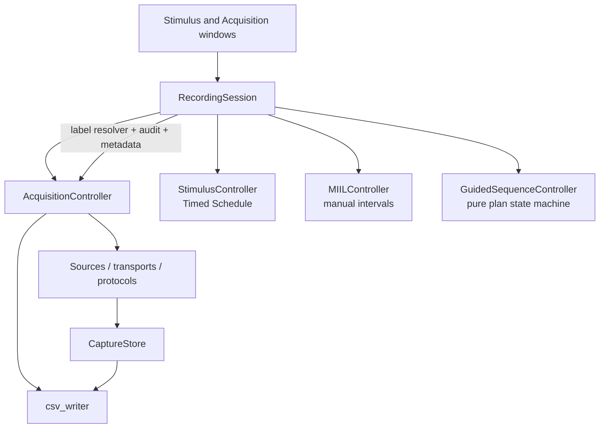
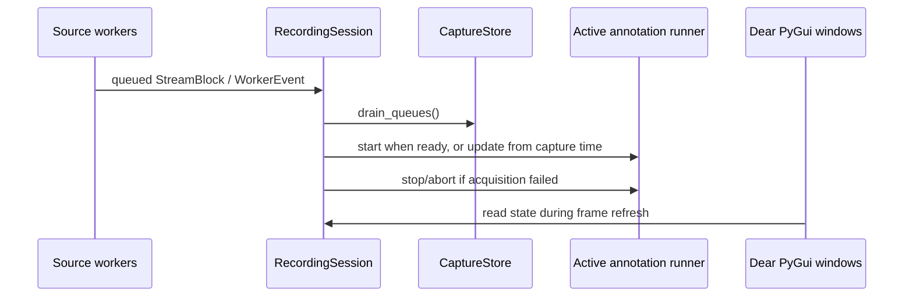
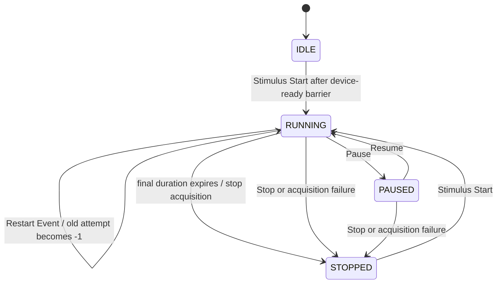
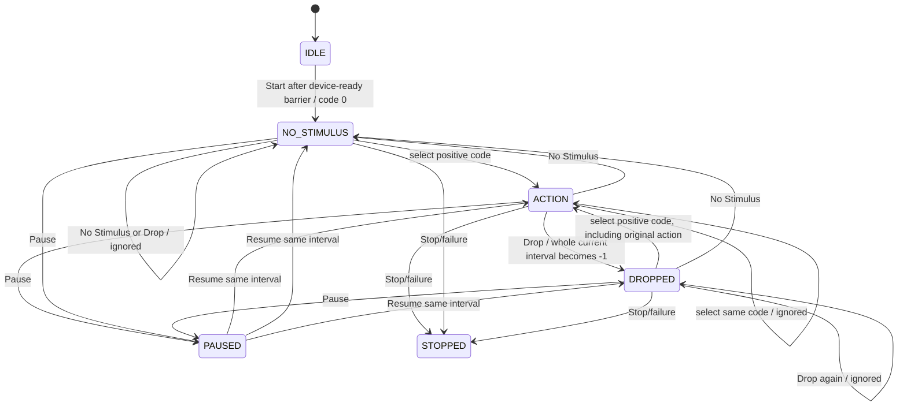
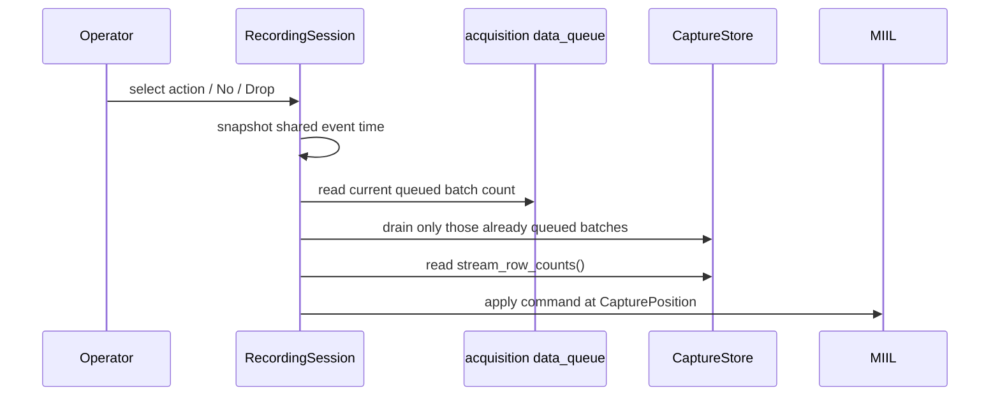
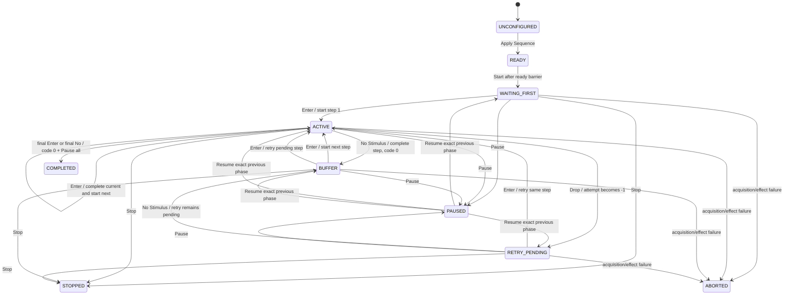
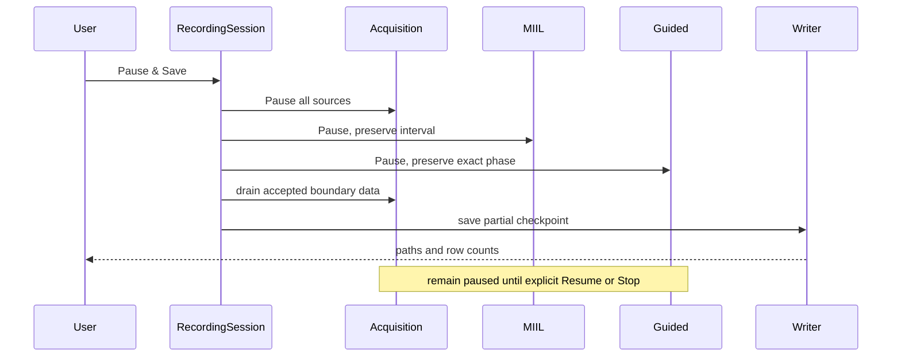

# 06 — Stimulus and Sample Labeling

Last verified against the repository on 2026-07-29.

This page documents the annotation subsystem as an implementation contract. It
distinguishes the legacy fixed-duration Timed Schedule, manual MIIL, and MIIL's
optional Guided Sequence. The word *stimulus* in this project usually means an
instruction label attached to acquired data; it does not imply that the
software presented a precisely timed visual, audio, or hardware stimulus.

## Architectural boundary

Acquisition is the sole owner of device and transport lifecycle. Annotation
runners do not connect, pause, resume, or disconnect an individual W2 or
BWT901 device. The only component allowed to coordinate the annotation and
acquisition lifecycles is `RecordingSession`.



The intended dependency rules are:

1. Sources, transports, and protocol parsers do not import a stimulus model.
2. Plotting reads `CaptureStore` and does not control or mutate annotation.
3. `GuidedSequenceController` is a pure state model. It returns requested
   effects; it does not import Dear PyGui, MIIL, or Acquisition.
4. `RecordingSession` applies those effects and verifies their postconditions.
5. Persistence receives generic label resolvers, audit rows, and metadata. The
   CSV writer does not import a concrete paradigm.

The principal implementation references are
[`recording_session.py`](../../fundamental/recording_session.py#L34),
[`stimulus_model.py`](../../fundamental/stimulus_model.py#L13),
[`miil_model.py`](../../fundamental/miil_model.py#L101), and
[`guided_sequence.py`](../../fundamental/guided_sequence.py#L1).

## Shared code semantics

The sensor-file contract is one integer `stimulus_code` per saved sample when
the capture has annotation enabled.

| Code | Meaning | Raw row retained | Normal offline policy |
| ---: | --- | --- | --- |
| `-1` | Invalid/dropped interval | Yes | Exclude |
| `0` | No stimulus / deliberately unlabelled buffer | Yes | Exclude |
| `> 0` | Configured action/instruction | Yes | Include after transition trimming and quality checks |

The action-to-code mapping saved with the capture is authoritative. Analysis
must not assume that code `1`, `2`, or `3` always has the default meaning.
Timed Schedule also uses `-1` for a restarted invalid attempt. MIIL preserves
the original positive code in its audit when an interval's effective code is
changed to `-1`.

## Lifecycle ownership and capture readiness

All selected sources pass the acquisition readiness barrier before an
annotation runner starts. While devices are connecting, `RecordingSession`
records a pending paradigm. Its frame callback starts the runner only after
Acquisition reaches `RUNNING`; a readiness failure clears the pending capture
and aborts a prepared Guided runner.

The application registers `RecordingSession.on_frame()` before the window
refresh callbacks in [`main.py`](../../fundamental/main.py#L15). A normal frame
therefore has this order:



Pause, Resume, and Stop are session-wide operations. No stimulus control is a
per-device switch.

## Timed Schedule

### Definition and configuration

A `StimulusEvent` contains exactly:

- `code`: a positive integer other than `0` and `-1`;
- `label`: a non-empty display/audit label;
- `duration_s`: a positive fixed duration.

The schedule is an ordered list. It cannot natively represent blocks, trials,
randomization, conditional branches, responses, or an operator-paced duration.
Repeated work is represented by explicitly repeating events in the list.
Configuration is rejected while the Timed runner is running or paused.

### Runtime state



`StimulusController.update()` uses a loop, so one delayed application frame can
close several elapsed events at their planned boundaries. `Restart Event`
closes the current attempt with status `restarted_invalid`, gives that attempt
saved code `-1`, and opens another attempt for the same planned event.

Timed Schedule remains in the legacy saved-sample time domain:
`RecordingSession.sample_time_s` is `CaptureStore.latest_time_s`. This is
different from MIIL's shared active-capture clock. It is intentional backward
compatibility, not a statement that the latest stream timestamp is a precise
stimulus-presentation onset.

### Important Start asymmetry

For Timed Schedule, the two Start controls are not equivalent:

- **Stimulus Start** calls `RecordingSession.start_stimulus()` and starts both
  acquisition and the Timed runner.
- **Acquisition Start** calls `RecordingSession.start_acquisition()` and starts
  a plain capture; it does not start the Timed runner.

This differs from MIIL, for which either Start path opens MIIL automatically.
Users who require Timed labels must start from the Stimulus window. A future
refactor should make this policy explicit rather than preserve an accidental UI
asymmetry.

### Completion and save

When the final Timed event completes naturally, `RecordingSession.on_frame()`
stops the complete acquisition. Manual Stop closes the current attempt at the
latest saved-sample time. Saving uses the time resolver
`stimulus_code_at(time_s)`, a frozen schedule snapshot, and the attempt audit.
Changing the editor after a stopped capture does not alter that capture's
saved schedule definition.

## Manual Instruction Interval Labeling (MIIL)

MIIL is operator-paced and has no automatic duration. An interval lasts until
the operator selects another action, selects No Stimulus, selects Drop, or
stops the recording.

### Codebook configuration

The initial applied codebook is:

| Internal action | Display label | Code |
| --- | --- | ---: |
| `rest` | Rest | `1` |
| `knee_flexion` | Knee Flexion | `2` |
| `knee_extension` | Knee Extension | `3` |

Normal codes must be unique positive integers. The identifiers
`no_stimulus` and `drop_stimulus`, and codes `0` and `-1`, are reserved.
Edits are allowed only while acquisition is stopped. Editing marks the UI
configuration dirty; Start is blocked until **Apply Actions** succeeds. The
applied codebook is frozen for the active capture.

The UI currently derives the internal action identifier from the display label
by case-folding and replacing separators. Changing a label can therefore
change the metadata identifier. If long-lived stable action identifiers become
important, expose a separate ID rather than silently changing this rule.

### Manual interval state and commands



Re-selecting the current normal action and re-selecting No Stimulus are no-ops.
This suppresses accidental double-click fragments.

Drop is retrospective. It changes the complete current interval's
`effective_code` to `-1`, including rows captured before the button press. It
does not delete or rewrite rows in memory. The original action/code and the
shared time at which Drop was pressed remain in the audit. The save resolver
assigns `-1` to the interval when files are written.

Pause preserves the current instruction and freezes elapsed display time.
Resume continues the same interval without creating an annotation boundary.
This matches acquisition behavior: rows are not appended while paused.

### Per-stream boundary coordinates

W2 and BWT901 streams can differ in rate, row count, packet size, and timestamp
drift. A MIIL boundary therefore records both:

1. shared active-capture time, for lifecycle, display, and audit; and
2. each stream's next zero-based row index, for authoritative save labeling.



Packets already queued at the click boundary are assigned to the preceding
interval because the new interval starts at the post-drain row cursor. Packets
arriving later remain for the next frame and receive the new interval. This is
an application-level boundary, not a hardware trigger; uncertainty remains on
the order of a device packet and UI/queue scheduling.

At save time `MIILController.sample_code(stream_id, row_index, time_s)` uses a
complete per-stream row index when available. If a stream was absent from any
boundary cursor, that stream falls back to shared time. Streams are never made
equal length and raw data is not resampled or padded.

## MIIL Guided Sequence

Guided Sequence is an optional MIIL sub-mode for a repeated, operator-paced
action order. It automates order and group counting only. It has no action
duration or countdown and does not validate participant behavior.

### Plan model and validation

`GuidedSequencePlan` stores a compact tuple of codes and a positive repeat
count. Group and step addressing is calculated from a flat index without
expanding all repeated steps.

A plan is valid only when:

- every planned code is a positive integer in the applied MIIL codebook;
- the pattern is non-empty and repeat count is positive;
- adjacent steps have different codes; and
- for more than one group, the final pattern code differs from the first.

The final two rules prevent a logical step boundary that MIIL cannot observe,
because selecting an already active code intentionally creates no new
interval. Representing consecutive trials of the same action will require a
separate trial identity or explicit boundary marker in a future schema.

### Runtime state machine



Operational details:

- Start opens MIIL at code `0` and enters `WAITING_FIRST`.
- The first Enter starts the first planned action.
- Each later Enter finishes the active attempt and starts the next action.
- The final action is not complete merely because it is displayed. It requires
  one additional Enter (or final No Stimulus) to close its interval.
- Completion selects code `0`, sets Guided to `COMPLETED`, and pauses the entire
  acquisition. Resume is locked; Save or Stop is required.
- No Stimulus completes a valid active step and enters a code-`0` buffer. It
  does not automatically start the next step.
- Drop marks the complete current MIIL interval `-1`, records a dropped
  physical attempt, does not increase completed progress, and makes the same
  group/step the next retry.
- Pause stores the exact previous Guided phase. Resume never advances a step.

Manual positive-code buttons are hidden in Guided mode and the session rejects
manual action selection at the backend. No Stimulus and Drop remain as guarded
exception controls.

### Frozen capture runner and fail-safe effects

The editable `session.guided_sequence` is a configuration model. At capture
start, `RecordingSession._prepare_guided_capture()` creates a separate runner
with the applied pattern and codebook. This prevents edits for the next
experiment from changing the current or most recently stopped capture.

Every accepted state-machine operation returns a `GuidedSequenceCommand` with
at most one MIIL effect plus an optional acquisition Pause. `RecordingSession`
applies the effect and verifies that MIIL reached the requested code and that a
completion Pause reached both Acquisition and MIIL. A failed postcondition
causes a full acquisition safety stop and an `ABORTED` Guided status. Do not
remove these checks when abstracting the paradigm interface.

## Save and persistence contract

### Files

For a multi-stream annotated capture, persistence produces:

```text
experiment_<timestamp>_<id>/
  capture.<safe-stream-id>.csv       # one per populated stream
  capture.stimulus.csv               # interval/attempt audit
  capture.metadata.json              # capture, stream, and paradigm metadata
```

Every annotated stream CSV has this conceptual order:

```text
time_s, <stream metadata fields>, stimulus_code, <signal fields>
```

The values in signal fields remain source output. Labeling does not drop code
`0` or `-1` rows, filter signals, align stream lengths, or resample data.

### Resolver types

`csv_writer.save_capture()` accepts exactly one of:

- `stimulus_code_for_time(time_s)` for Timed Schedule; or
- `stimulus_code_for_sample(stream_id, row_index, time_s)` for MIIL and Guided.

Supplying both is an error. This mutually exclusive resolver boundary keeps
the writer independent from the paradigm while preserving the materially
different Timed and MIIL coordinate systems.

### Stimulus sidecar

`capture.stimulus.csv` always begins with:

```text
event_index, stimulus_code, planned_code, label,
start_time_s, end_time_s, status
```

It then includes a deterministic alphabetic union of extra scalar fields.
MIIL contributes fields such as action, original code, duration, and Drop press
time. Guided planned-action rows additionally receive group, step, attempt,
outcome, and ending-input fields. Nested row-cursor maps are not flattened into
this CSV; the metadata JSON is authoritative for complex values.

### Metadata

The `stimulus` block in `capture.metadata.json` contains the paradigm identity,
state, reserved-code semantics, and a frozen definition.

MIIL adds:

- the frozen codebook;
- every interval's original and effective codes;
- shared start/end time and per-stream start/end row cursors;
- Drop audit information;
- `per_stream_row_cursor_with_shared_time_fallback`; and
- offline trimming/windowing recommendations.

Guided adds:

- compact pattern codes, repeat count, steps per group, and total steps;
- pattern action IDs and display labels;
- completed/active/next/retry progress;
- save status (`completed`, `partial_checkpoint`, `stopped_early`, or
  `aborted`);
- save-time shared time and row cursors; and
- every physical attempt, linked to its MIIL event index.

### Running Guided checkpoint

The low-level Acquisition save guard rejects a running save. For a running
Guided capture, `RecordingSession.save()` performs this coordinated operation:



The active attempt remains `active_at_save`; checkpointing does not complete a
step. Reusing the same path overwrites the previous checkpoint files. Current
writes are per-file direct writes rather than an atomic experiment-directory
transaction, so a process or disk failure can leave a partial set. This is a
known persistence risk.

## Offline interpretation

MIIL and Guided label the requested task, not observed movement onset,
completion, or compliance. Use positive-code intervals only after transition
trimming and quality review. Default metadata recommendations are:

- trim action starts by about `1.0 s` and ends by `0.5-1.0 s`;
- trim Rest starts by `0.5-1.0 s` and ends by about `0.5 s`;
- reject less than `1.5-2.0 s` usable duration;
- use `200-300 ms` windows with `50%` overlap; and
- never cross an interval boundary, even when adjacent intervals have the same
  classification class in derived data.

The current boundary is appropriate for steady-state offline classification,
not exact EMG onset, reaction time, kinematic phase, millisecond closed-loop
control, or hardware synchronization claims.

## Refactoring and extension guidance

Preserve these contracts during refactoring:

- Acquisition remains the only device lifecycle owner.
- `RecordingSession` remains the capture-level coordinator.
- sensor CSVs retain one backward-compatible integer `stimulus_code`;
- complex trial/block/response data belongs in sidecar and metadata;
- per-stream row cursors remain available for manual boundaries; and
- a failed Guided effect stops safely rather than allowing silent divergence.

The next useful abstraction is an immutable paradigm definition plus a
per-capture runner. A small runner adapter should expose lifecycle operations,
completion policy, event rows, metadata, and either a time or sample resolver.
Do not erase the distinction between those resolver types. The position passed
to a runner should be able to carry shared capture time, legacy sample time,
and stream row cursors.

New block/trial hierarchies or randomized paradigms should not expand the raw
sensor schema. Store trial identity, random seed, compiled order, responses,
and presentation audit in versioned JSON/sidecar data. True visual/audio
presentation and hardware triggers should be separate Presenter/Trigger
services rather than added to device sources or the MIIL model.
