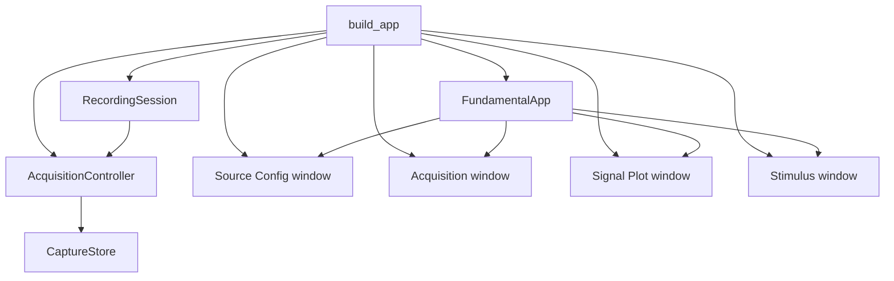
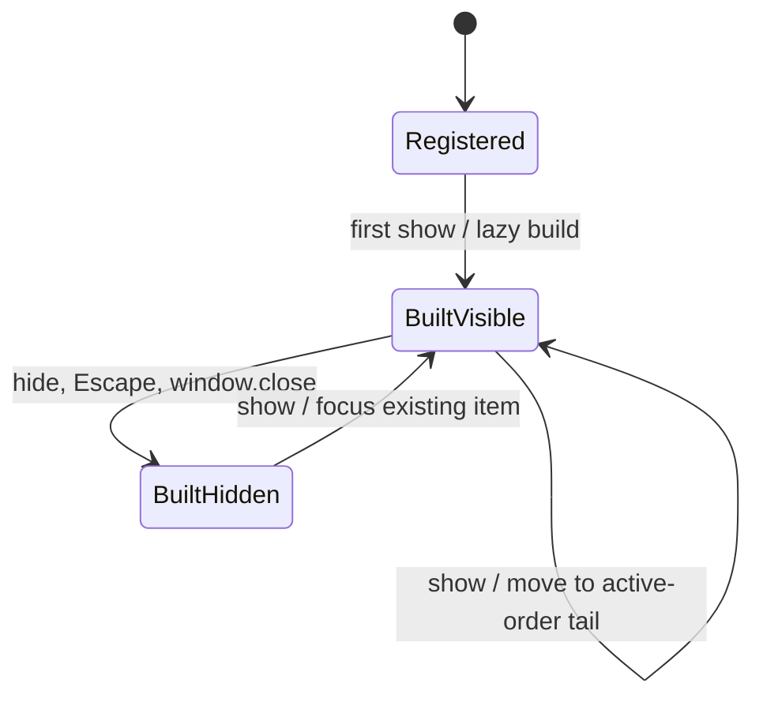
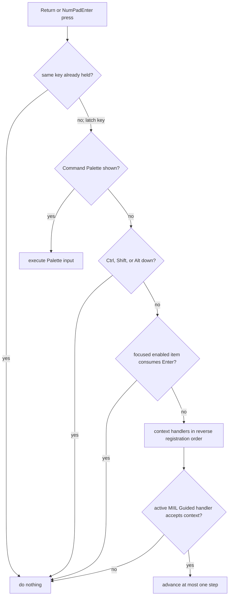
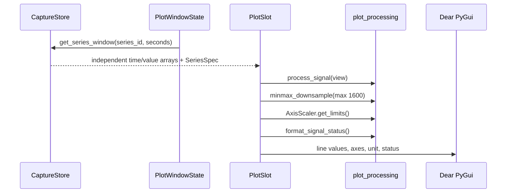

# 07 — UI Shell, Commands, Keyboard Input, and Plotting

Last verified against the repository on 2026-07-29.

This page documents the Dear PyGui application shell and its interaction
contracts. It also records how the generic Plot window discovers and displays
W2, BWT901, and other streams. Stimulus domain semantics and saved-label
details are covered in [Stimulus and Sample Labeling](06-stimulus-labeling.md).

## Application composition and frame order

[`main.build_app()`](../../fundamental/main.py#L15) explicitly constructs and
registers the application's services and windows:

Services are registered under `acquisition`, `stimulus`, `miil`,
`guided_sequence`, and `recording_session`. Treat these names as application
integration API, not as a persistence schema. In particular, the registered
`guided_sequence` service is the editable configuration controller; an active
capture uses the frozen runner exposed by `RecordingSession.capture_guided_sequence`.

The shell loop calls all frame callbacks and then renders one Dear PyGui frame
([`app_shell.py`](../../fundamental/app_shell.py#L91)). Current registration
order is significant:

1. `RecordingSession.on_frame()` drains source queues, resolves readiness, and
   updates/stops annotation.
2. Source Config and Acquisition windows refresh.
3. Plot refreshes from `CaptureStore`.
4. Stimulus refreshes operator state and optional focus restoration.

This keeps visible state one logical update behind neither the worker queue nor
the annotation runner. New callbacks that mutate capture state should be
placed deliberately; do not rely on unspecified registration order.

## Command registry

The command registry is UI-framework-independent. `CommandSpec` defines a
canonical name, description, handler, aliases, and visibility; execution
receives a `CommandContext` with access to the app and raw arguments
([`commands.py`](../../fundamental/commands.py#L20)). Names and aliases are
case-insensitive and stripped before lookup.

### User-visible commands

| Command | Alias | Purpose |
| --- | --- | --- |
| `source` | `device` | Open Source Config |
| `acquisition` | `record` | Open Acquisition controls |
| `plot` | none | Open Signal Plot |
| `stimulus` | `indication` | Open Stimulus configuration/operator console |

### Shell/internal commands

| Command | Visibility | Purpose |
| --- | --- | --- |
| `help` | hidden | Log all registered commands |
| `palette.open` | hidden, alias `command` | Open Command Palette |
| `log.clear` | hidden | Clear log entries |
| `window.close` | hidden | Close the most recently active unprotected managed window |
| `quit` | hidden | Stop Dear PyGui |

`Ctrl+Shift+P` opens the Command Palette. Typing filters canonical names,
descriptions, and aliases. Enter executes the input and closes the Palette.
The Palette is intentionally the highest-priority consumer of Enter.

## Managed windows

`WindowManager` stores lazy `ManagedWindow` builders and builds a window the
first time it is shown ([`window_manager.py`](../../fundamental/window_manager.py#L11)).
It tracks show order so Escape or `window.close` can hide the most recently
active unprotected window. The Log window is protected.

Window show/hide is not destruction. Dear PyGui values and each window's state
remain in memory while hidden. Feature code must refresh authoritative model
state when reopening rather than assume widget values are current.

The manager's active order changes only when the app calls `show()` or
`hide()`. Clicking an already visible Dear PyGui window does not currently
update that order. Therefore `window.close` means “most recently shown managed
window,” not necessarily the OS-level focused window.

## Context Enter routing and safety

The application-wide Enter handler exists to advance an active MIIL Guided
Sequence while allowing normal widget and Command Palette behavior.
Both the main Return and numeric-keypad Enter keys are registered with press
and release handlers ([`app_shell.py`](../../fundamental/app_shell.py#L223)).

### Priority pipeline

The held-key latch allows one action per physical press. Release removes the
latch. Each frame also checks `dpg.is_key_down()` and clears stale latches, so
a lost release event does not permanently disable Enter.

An enabled focused input, drag, slider, combo, button, checkbox, radio button,
selectable item, or menu item consumes Enter before context actions. Disabled
items do not. This deliberately makes a focused button safe: pressing Enter
does not unexpectedly advance Guided while the operator is still interacting
with that control.

### Guided-specific guards

The Stimulus handler consumes but does not advance Enter when a Guided capture
exists but Acquisition or Guided is not in an advanceable running state. It
also requires the Stimulus window to be shown. These guards prevent a hidden
experiment controller from responding to ordinary Enter presses elsewhere.

Advanceable phases are:

- `WAITING_FIRST`;
- `ACTIVE`;
- `BUFFER`; and
- `RETRY_PENDING`.

The Plot window may have focus while Stimulus remains visible. Enter can still
advance if the focused Plot item is not an input or interactive control. If a
Series/View/Scale combo or Plot button has focus, Enter is intentionally
blocked. Starting, resuming, or changing to an advanceable Guided phase asks
Dear PyGui to restore focus to the Stimulus window when it is visible.

This is application-level keyboard protection, not a hard real-time input
system. Before relying on a new OS, keyboard, docking layout, or IME, run the
physical keyboard checklist in [Testing and Debugging](08-testing-debugging.md).

## Acquisition and Stimulus control surfaces

Both windows call the same `RecordingSession` methods; they do not own device
workers.

### Acquisition window

The compact Acquisition window provides Start, Pause, Stop, Save, Save Path,
state/row count, and the active source description
([`acquisition_window.py`](../../fundamental/acquisition_window.py#L59)).

- Start is disabled while source startup is active, MIIL/Guided edits are
  unapplied, or a completed Guided capture remains paused.
- Its Start button doubles as Resume because `start_acquisition()` dispatches
  to `session.resume()` when Acquisition is paused.
- Save is labelled **Pause & Save** only for a running Guided capture. In all
  other states it is labelled **Save**.
- Save is enabled only when buffered rows exist and either Acquisition is not
  active or the Guided Pause-and-Save transaction is available.

### Stimulus window

The Stimulus window combines a lifecycle toolbar, paradigm selector, Timed
editor, MIIL editor, Guided builder, operator console, exception controls, and
history ([`stimulus_window.py`](../../fundamental/stimulus_window.py#L155)).

- The paradigm selector is locked during an active/paused capture.
- Timed configuration and runtime controls are shown only for Timed Schedule.
- MIIL setup is shown only while Acquisition is stopped.
- Editing actions or a Guided plan marks that layer dirty and blocks Start
  until Apply succeeds.
- Guided configuration is revealed only when its checkbox is enabled.
- Guided runtime hides normal manual action buttons; No Stimulus and Drop
  remain state-dependent exception controls.
- The operator console displays mode, state, active action/code, elapsed time,
  group/step/attempt, next instruction, progress, and Enter guidance.

`stimulus_window.py` currently has module-level widget signatures, editor
lists, and focus flags. This assumes one application, one Stimulus window, and
one session per process. It works today but is not a reusable multi-window UI
architecture.

### Save Path duplication

Acquisition and Stimulus each have a separate Dear PyGui Save Path input. Each
save action reads its own widget; open/start/save operations force selected
sync points, while normal refresh preserves a non-empty edited value. If both
windows are open and paths are edited independently, they can diverge. A
future non-functional cleanup should put the value in a session-level model
and bind both widgets to it.

## Generic Plot window

The Plot window depends on the structural, read-only `PlotDataProvider`
protocol and the generic `SeriesSpec`/`SeriesWindow` contracts. `CaptureStore`
is the current provider, but Plot does not import it, know W2/BWT protocols, or
inspect acquisition and stimulus controllers
([`plot_window.py`](../../fundamental/plot_window.py)).

### Catalog lifecycle and module independence

`PlotWindowState` starts empty: it does not capture the application's initial
ADS1299 schema or any other source schema during registration. On every frame,
and again before the first lazy window build, it pulls the current immutable
`SeriesSpec` tuple from its provider and reconciles that tuple with its cached
catalog. The complete specs form the signature, so changes to units, labels,
signal kind, rate, or display hints are detected even when series IDs remain
the same.

Catalog reconciliation, widget rebuilding, and value refresh are deliberately
one-way operations. Rebuilding the slot widget tree never calls catalog
refresh. This prevents a first-open source change from recursively deleting and
rebuilding Dear PyGui children while their original build is still active.
When the provider has no series, Plot remains a valid empty window and creates
generic Raw slots only after series become available.

### Series discovery

Every signal field in a configured `StreamSpec` becomes a scalar `SeriesSpec`
with:

- a stable `series_id` (`stream_id/field_key`);
- display label and unit;
- `signal_kind`;
- `default_plot`; and
- optional fixed y-axis range.

The selector displays the source/stream/field label but stores the series ID.
W2 EMG fields are marked as default plots. BWT901 acceleration, angular
velocity, and angle fields enter the same catalog and can be chosen in any
slot. Plotting never requires streams to have equal rates or row counts.

When the catalog signature changes, `PlotWindowState.sync_catalog()` restores
default slots. This is useful after Source Config Apply but currently discards
the operator's custom slot arrangement.

### Slot model

Each `PlotSlot` independently stores:

- selected series ID;
- signal view;
- scale mode;
- a smoothed `AxisScaler`; and
- Dear PyGui tags generated from a monotonically allocated slot ID.

The window supports 1 to 16 slots. The operator can add/remove slots, choose
compact or comfortable density, hide per-slot controls, set every slot to Raw
or Robust Scaling, and restore source defaults. The visible time window is
1-30 seconds.

### Update and display processing

Refresh is throttled to 25 Hz and each displayed line is min/max downsampled to
at most 1600 points. Processing works on copied recent-window values. It does
not mutate `CaptureStore` and has no effect on saved CSV values.

### EMG and IMU view contract

New slots begin with the first view advertised by `SeriesSpec.view_options`
(currently Raw for every signal kind); Plot does not assign transforms by slot
position. `SeriesSpec.view_options` is based on `signal_kind`
([`streams.py`](../../fundamental/streams.py#L133)):

| Signal kind | Available views | Status text |
| --- | --- | --- |
| `emg` | Raw, Rectified, RMS, Envelope | Peak and RMS |
| acceleration / angular velocity / generic | Raw only | Current, Min, Max |

RMS uses a 50-sample moving RMS; Envelope uses a 100-sample moving average of
absolute values. These windows are sample counts, not durations, so their time
span depends on source rate. They are display transforms only.

BWT901 IMU data is never passed through Rectified/RMS/Envelope because its
series exposes only Raw. Its header statistic is Current/Min/Max, not EMG RMS.
Acceleration keeps unit `g`, gyroscope keeps `dps`, and angle keeps `deg`.

### Axis behavior

Available scale modes are:

- **Robust Scaling**: percentile-like robust limits with smoothing; reports
  points outside the visible axis;
- **Full Range**: limits from the current processed window; and
- **Fixed Range**: a series-provided range where available, otherwise the
  generic bipolar/unipolar fallback.

Changing series or view resets that slot's scaler. The x-axis is always shown
relative to the most recent sample, from negative window duration to zero.
Only the bottom slot shows x tick labels.

## UI and Plot refactoring guidance

The shell boundaries worth preserving are:

- feature modules register commands and lazy windows;
- the command registry remains independent of Dear PyGui;
- application-wide key priority is centralized;
- Plot consumes a generic read-only `PlotDataProvider`, never `CaptureStore`
  mutation APIs or source protocols; and
- display processing never alters saved raw data.

Recommended incremental improvements:

1. Split `stimulus_window.py` into instance-based Timed, MIIL configuration,
   Guided, and Operator Console panels with a shared lifecycle toolbar.
2. Replace module-level editor/signature state with a per-window view model.
3. Generalize `ContextEnterHandler` into an input-action router with explicit
   priority and enable predicates, while preserving Palette/focus/latch rules.
4. Share Save Path through a session/UI model.
5. Persist Plot layouts by series ID and reconcile them when the catalog
   changes instead of resetting every customization.
6. Keep signal transforms declarative on `SeriesSpec`; if time-based filters
   are added, use nominal/observed rate explicitly rather than silently treating
   a sample count as a duration.
7. Do not add source- or protocol-specific `if` branches to Plot. New device
   data should be described through `StreamSpec`/`FieldSpec`/`SeriesSpec`.
