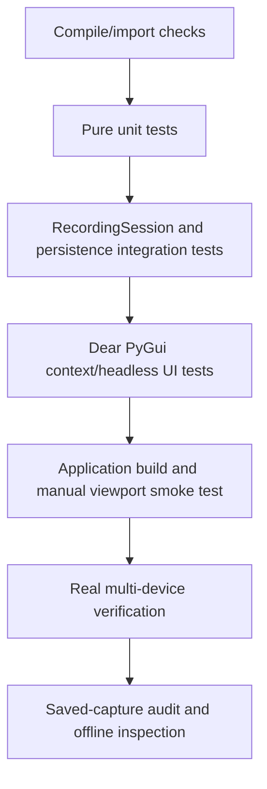

# 08 — Testing, Debugging, and Hardware Verification

Last verified against the repository on 2026-07-29.

This page describes how to validate changes, map tests to subsystem contracts,
debug common operator-visible failures, and perform the hardware checks that
unit tests cannot replace.

## Validation levels

Use the smallest useful test first, then expand in proportion to the change.



Pure model or formatting changes may stop at unit/integration coverage. Changes
to keyboard routing, source lifecycle, timing, queue boundaries, saving, or
device configuration require the later levels as well.

## Standard commands

Run commands from the repository root. The project uses `uv` for its Python
environment.

Compile the primary packages and tests:

```powershell
uv run python -m compileall -q DeviceInterface fundamental tests
```

Run the complete unittest suite:

```powershell
uv run python -m unittest discover -s tests -v
```

Run the Stimulus/Guided/UI subset while iterating:

```powershell
uv run python -m unittest `
  tests.test_guided_sequence `
  tests.test_miil_model `
  tests.test_recording_session `
  tests.test_app_shell_keyboard `
  tests.test_acquisition_window `
  tests.test_stimulus_window -v
```

Run plot and persistence contracts:

```powershell
uv run python -m unittest `
  tests.test_plot_processing `
  tests.test_capture_store -v
```

Check patch whitespace before committing:

```powershell
git diff --check
```

Always inspect `git status --short` before staging. The workspace can contain
user-owned experiments, notebooks, device demos, or unrelated configuration
changes; do not stage them merely because they are present.

## Test architecture and contract map

### Pure domain models

| Contract | Test location | What is protected |
| --- | --- | --- |
| Guided plan validation | [`test_guided_sequence.py`](../../tests/test_guided_sequence.py#L12) | Non-empty positive codes, codebook membership, repeat count, ambiguous adjacent/group boundaries |
| Guided addressing | same file | Compact pattern, group/step mapping without expanded plan |
| Guided runtime | [`test_guided_sequence.py`](../../tests/test_guided_sequence.py#L49) | Initial code-0 wait, Enter sequence, final extra Enter, No buffer, Drop retry, progress |
| Guided lifecycle/audit | same file | Pause/Resume exact phase, Stop/Abort, monotonic event time, attempts and metadata |
| MIIL codebook | [`test_miil_model.py`](../../tests/test_miil_model.py#L17) | Positive unique codes, reserved names/codes, configuration freeze |
| MIIL interval behavior | [`test_miil_model.py`](../../tests/test_miil_model.py#L93) | Start at 0, repeated selection no-op, retrospective Drop, Pause, row/time resolution |
| MIIL audit | [`test_miil_model.py`](../../tests/test_miil_model.py#L195) | Original/effective code, Drop time, metadata recommendations |
| Plot transforms | [`test_plot_processing.py`](../../tests/test_plot_processing.py#L16) | Moving average/RMS, units, min/max downsampling, scaling, EMG vs IMU status |

Pure tests should not import Dear PyGui or construct acquisition workers. When
a new state transition can be expressed in a pure controller, test it there
before adding session/UI tests.

### Session integration

[`tests/test_recording_session.py`](../../tests/test_recording_session.py#L140)
uses small fake acquisitions to test capture-level coordination. Its coverage
includes:

- applied-plan gating;
- Guided Enter through MIIL boundaries and final all-device Pause;
- Stop followed by a fresh capture;
- Drop retry and inserted No-Stimulus buffers;
- backend rejection of manual Guided action selection;
- fail-safe abort when a requested MIIL effect or completion Pause fails;
- running Guided Pause-and-Save checkpoint and exact Resume;
- frozen capture plan while the next plan is edited;
- source readiness barrier and failure abort;
- MIIL automatic code-0 start from Acquisition Start;
- dirty MIIL action gating;
- independent stream row boundaries and save metadata;
- queue-drain semantics at an operator click;
- MIIL Drop plus Pause without interval splitting;
- Timed schedule readiness, save resolver, frozen schedule, and sample-time
  domain;
- stale-label clearing for a subsequent plain acquisition; and
- annotation shutdown on acquisition failure or natural Timed completion.

These tests intentionally verify `RecordingSession` as the only lifecycle
coordinator. A new paradigm should add an adapter-level test and session
characterization without importing device transports into the test.

### Headless Dear PyGui tests

| File | Covered behavior |
| --- | --- |
| [`test_app_shell_keyboard.py`](../../tests/test_app_shell_keyboard.py#L11) | Enter press/release latch, Return and NumPadEnter, Command Palette priority, modifiers, focused controls |
| [`test_stimulus_window.py`](../../tests/test_stimulus_window.py#L17) | Guided builder, Apply/Clear, manual/Timed visibility, visible vs hidden Enter, Drop retry display, restore Manual UI after Stop |
| [`test_acquisition_window.py`](../../tests/test_acquisition_window.py#L16) | Dirty Guided status/Start gating, completed-capture Resume lock, new Start after Stop |

These tests create a Dear PyGui context but do not show a real viewport. They
are fast and valuable for widget properties, but they do not prove physical
keyboard, focus, docking, rendering, DPI, or GPU behavior.

Some UI tests currently create runtime scenarios by assigning private
`RecordingSession` fields. That is a test-maintenance risk. Prefer a reusable
public test harness that starts a fake ready capture when refactoring; do not
weaken production encapsulation merely to preserve private-field tests.

### Persistence and stream contract tests

[`tests/test_capture_store.py`](../../tests/test_capture_store.py#L47) covers:

- separate W2 and BWT901 stream files in one experiment directory;
- exact `stimulus_code` header placement;
- independent stream rates and row counts;
- time-based and sample-based label resolvers;
- per-stream row-boundary assignment;
- mutual exclusion of resolver types;
- deterministic scalar sidecar fields; and
- unchanged raw headers for unannotated legacy streams.

Timed controller contract tests currently live in
[`test_ads1299_protocol.py`](../../tests/test_ads1299_protocol.py#L263). They
cover time labeling, restart invalidation, and sidecar output but are not
ADS1299-specific. Move them to a dedicated Timed stimulus test module during a
future test-only cleanup.

## State-machine test rules

When changing MIIL or Guided behavior, assert both state and side effects. A
message-only assertion is insufficient.

Useful invariants are:

- `0 <= completed_steps <= total_steps`;
- completed-step count never decreases;
- Drop never increments completed progress;
- a retry uses the same flat group/step index and increments attempt number;
- one accepted Guided command requests at most one MIIL transition;
- Pause/Resume preserves the current MIIL interval and exact Guided phase;
- `COMPLETED` implies a successful all-device Pause, otherwise the runner is
  converted to `ABORTED` and Acquisition is stopped;
- a capture runner's plan/codebook does not change when next-capture setup is
  edited; and
- event time and row boundaries never move backward.

The number of Guided states makes table-driven or model-based invariant tests
a useful future addition. Keep explicit scenario tests as readable examples.

## Debugging workflow

Start from the visible state, then inspect the session and saved audit rather
than immediately changing source or protocol code.

### Start is disabled or immediately rejected

Check in order:

1. Is Acquisition `STOPPED`, rather than `STARTING`, `RUNNING`, or `PAUSED`?
2. Does the status say **MIIL ACTIONS NOT APPLIED**? Apply the action codebook.
3. Is Guided enabled and **SEQUENCE NOT APPLIED**? Apply a non-empty valid
   plan.
4. Does the plan contain adjacent equal codes, or equal last/first codes with
   repeat greater than one?
5. Is a completed Guided capture still paused? Save or Stop; Resume is
   intentionally locked.
6. Are required devices still waiting at the readiness barrier? Inspect Device
   Health and application log before changing Stimulus.

Relevant code paths are `RecordingSession._guided_start_error()`, the MIIL
dirty flags, and each window's refresh/enable logic.

### Enter does not advance Guided Sequence

Check the operator console and log:

1. Stimulus must still be the selected MIIL paradigm.
2. A frozen Guided runner must exist for this capture.
3. Acquisition must be `RUNNING`.
4. Guided must be `WAITING_FIRST`, `ACTIVE`, `BUFFER`, or `RETRY_PENDING`.
5. The Stimulus window must be visible.
6. Command Palette must be closed.
7. Ctrl, Shift, and Alt must be released.
8. Focus must not be on an input, combo, slider, button, checkbox, or other
   interactive widget.
9. Release and press Enter again; the one-press latch deliberately ignores key
   repeat.

An ignored Enter is logged. Do not bypass these guards to make a single
keyboard/layout work; first reproduce with both Return and NumPadEnter and
record the focused Dear PyGui item type.

### Guided state and MIIL code disagree

This should cause an automatic safety stop. Preserve:

- the application log text around **Guided Sequence safety stop**;
- Acquisition and MIIL final states;
- Device Health entries;
- the Guided metadata/attempt audit if saving is still possible; and
- the exact command (Enter, No, Drop, Save) that triggered the mismatch.

The session verifies action-code, no-stimulus, Drop, and completion-Pause
postconditions. A silent mismatch is a correctness bug; do not convert the
safety stop into a warning.

### Samples have unexpected stimulus codes

Inspect all three layers:

1. `capture.metadata.json → stimulus.codebook` for the frozen code meaning.
2. `capture.stimulus.csv` for interval order, original/effective code, status,
   duration, Drop press time, and Guided fields.
3. `capture.metadata.json → stimulus.intervals` for each stream's start/end row
   counts.

For MIIL, compare the suspect CSV row index with its stream-specific cursor;
do not compare EMG and IMU by equal row number. If a stream is absent from a
boundary cursor, confirm the shared-time fallback. Remember that already
queued packets at a click are drained into the preceding interval by design.

For Timed Schedule, inspect sample timestamps and the frozen schedule. Timed
uses saved-sample time, not MIIL's shared active-capture clock.

### Drop appears to affect samples before the click

This is expected. Drop invalidates the complete current interval from its
start. The sidecar keeps `planned_code`/original code and Drop press time for
audit. Offline analysis should exclude code `-1` rather than try to retain the
pre-click portion.

### Save is disabled or rejected

- There must be at least one buffered row.
- A normal Timed or manual MIIL capture must be Paused or Stopped before save.
- A running Guided capture exposes **Pause & Save**; the session first pauses
  everything, drains the boundary, saves, and stays paused.
- If Pause fails, the Guided transaction safety-stops instead of writing an
  apparently live checkpoint.
- Verify which window's Save Path is being used. Acquisition and Stimulus
  currently have separate input widgets that can diverge.
- Check directory permissions, available disk space, and the complete returned
  list of stream/metadata/sidecar paths.

Saving the same experiment path again overwrites the previous checkpoint
files. Writes are not yet an atomic directory transaction. After an I/O or
process failure, verify every stream file, metadata JSON, and sidecar rather
than assuming the folder is internally consistent.

### Plot is empty, resets, or shows an unexpected transform

1. Confirm Source Config Apply exposed the expected stream and field.
2. Check Plot status for stream/series count and latest values.
3. Choose the series by its display label and inspect the summary's view/scale.
4. A source catalog change restores default slots and can discard a custom
   layout.
5. IMU fields intentionally offer Raw only and show Current/Min/Max. If an IMU
   slot offers RMS, its `signal_kind`/`SeriesSpec` is wrong.
6. Plot transforms and min/max downsampling affect display only. Inspect the
   saved CSV when investigating raw-data correctness.
7. At most 1600 points per line are drawn and refresh is capped at 25 Hz; this
   can hide individual high-rate samples visually but does not drop stored
   rows.

### Acquisition or annotation stops unexpectedly

Review the first worker error, not only the final stop message. An acquisition
failure intentionally stops the active Timed/MIIL runner and aborts Guided.
Timed natural schedule completion also stops all acquisition by policy, while
Guided completion pauses it. Confirm which completion policy was active before
diagnosing device failure.

## Real hardware verification checklist

Run this checklist after changes to source lifecycle, shared timing, MIIL
boundaries, Guided controls, keyboard routing, saving, or plot catalog. Use the
actual intended setup: multiple serial W2 devices and one or two Bluetooth
BWT901 devices. Record software commit, ports, BLE addresses, device names,
configured rates, and OS before testing.

### A. Connection and readiness

- [ ] Configure every W2 with a unique ID/name and serial Port; verify the
      intended baud value in the applied Source Config.
- [ ] Configure each BWT901 with a unique ID and BLE address.
- [ ] Start with 1 W2 + 1 BWT901; then repeat with the maximum planned device
      set (up to 5 W2 + 2 BWT901).
- [ ] Confirm all required devices report ready before Acquisition changes from
      `STARTING` to `RUNNING`.
- [ ] Confirm MIIL stays IDLE while devices are connecting and opens code `0`
      only after the barrier.
- [ ] Verify every expected stream and field appears in Plot and Device Health.
- [ ] Verify a missing/unavailable required device prevents a partial
      experiment rather than silently starting the remaining subset.

### B. Manual MIIL

- [ ] Start from both Acquisition and Stimulus controls; both should open MIIL
      at No Stimulus after readiness.
- [ ] Select each configured action and visually verify action label, code,
      elapsed timer, and history.
- [ ] Re-select the current action; confirm no short duplicate interval appears.
- [ ] Select No Stimulus and confirm code `0` while all streams continue.
- [ ] Drop a normal interval after several seconds; confirm display code `-1`
      and the entire saved interval later resolves to `-1`.
- [ ] Attempt Drop while No Stimulus is active and repeat Drop; confirm both are
      ignored without fragments.
- [ ] Pause for several seconds and Resume; confirm action and interval are
      preserved and elapsed time freezes during Pause.
- [ ] Hold representative actions for 5-10 seconds; verify no automatic timeout.

### C. Guided Sequence and keyboard

- [ ] Configure and Apply a multi-action, multi-group plan.
- [ ] Confirm unapplied plan edits block Start.
- [ ] Start and verify the initial `WAITING_FIRST` code-0 phase.
- [ ] Test both main Return and NumPadEnter.
- [ ] Hold each key down; confirm one physical press advances at most once.
- [ ] Verify the first Enter starts step 1 and each subsequent Enter advances
      exactly one planned step.
- [ ] Verify the final action remains active until an extra Enter closes it.
- [ ] Confirm final completion selects code `0`, pauses all devices, shows 100%
      progress, and locks Resume.
- [ ] Insert a No-Stimulus buffer mid-plan; verify progress completes only the
      current step and the next action waits for Enter.
- [ ] Drop a planned attempt; verify progress does not advance and the next
      Enter retries the same group/step with attempt number incremented.
- [ ] Pause from ACTIVE, BUFFER, and RETRY_PENDING where practical; Resume must
      return to the same phase.
- [ ] Hide Stimulus and press Enter; confirm it is consumed/logged but does not
      advance.
- [ ] Keep Stimulus visible while Plot has focus; confirm Enter advances from a
      non-interactive plot area.
- [ ] Focus Series/View/Scale combo, a text input, and a button; confirm Enter
      does not advance.
- [ ] Open Command Palette; confirm Enter executes the palette command rather
      than Guided.
- [ ] Hold Ctrl, Shift, or Alt with Enter; confirm no advance.
- [ ] Exercise the actual docking layout, display scaling, IME, and keyboard
      intended for experiments.

### D. Plot verification

- [ ] Plot at least one W2 EMG Raw series and confirm plausible waveform/rate.
- [ ] Test Rectified, RMS, and Envelope for EMG only; confirm these do not alter
      a later saved raw CSV.
- [ ] Plot BWT901 acceleration, gyro, and angle; confirm units and plausible
      ranges/orientation response.
- [ ] Confirm IMU offers Raw only and reports Current/Min/Max, with no RMS label.
- [ ] Compare Robust, Full Range, and available Fixed Range behavior.
- [ ] Add/delete slots up to the operational layout and verify refresh remains
      responsive during the full device load.
- [ ] Apply a changed Source Config and confirm the series catalog rebuild is
      expected; note that custom layout currently resets.

### E. Save and saved-data audit

- [ ] Save a paused manual MIIL capture and a completed Guided capture.
- [ ] During an active Guided step select Pause & Save; confirm all devices
      pause, files are written, metadata says `partial_checkpoint`, active
      attempt says `active_at_save`, and Resume returns to the same step.
- [ ] Stop/save early and verify Guided status `stopped_early`.
- [ ] Force or simulate a device disconnect; confirm fail-fast Stop/Abort and
      useful Device Health/log details.
- [ ] Confirm one CSV exists for every populated W2/BWT stream and row counts
      may legitimately differ.
- [ ] Confirm each annotated stream header contains exactly one
      `stimulus_code` in the expected position.
- [ ] Confirm code `0` and `-1` raw rows are retained.
- [ ] Open metadata JSON and verify frozen codebook, interval time/row cursors,
      boundary method, stream descriptions, and device health.
- [ ] Open stimulus sidecar and verify interval order/duration/status, Drop
      audit, and Guided group/step/attempt/outcome fields.
- [ ] Compare several transition rows independently in each stream against the
      metadata row cursors.
- [ ] Run a continuous 5-10 minute maximum-device capture; inspect packet loss,
      observed rates, row counts, clock/timestamp monotonicity, UI responsiveness,
      and complete save time.
- [ ] Reload saved files with the downstream analysis code before deleting or
      reusing the experiment path.

## Known validation gaps

The automated suite does not yet cover:

- a real Dear PyGui viewport with OS focus/docking and a physical keyboard;
- actual serial/BLE packet arrival racing an operator boundary;
- long-duration maximum-device resource and timing behavior;
- hardware synchronization or presentation onset;
- disk-full, permission, process-crash, and atomic multi-file save behavior;
- metadata/sidecar schema-version compatibility fixtures;
- synchronization of the two Save Path widgets;
- focus restoration and stale held-key cleanup as full UI integration;
- a single end-to-end key press through AppShell, Stimulus window, Session,
  MIIL, CSV save, and file reload; and
- exhaustive state-machine transition/property testing.

Treat these as explicit limits, not evidence that the behavior is broken. Add
targeted tests before modifying code in the affected area.

## Adding tests safely

Follow these conventions:

1. Put pure transition rules in model tests.
2. Use `RecordingSession` fakes for lifecycle coordination; do not start real
   serial/BLE workers in unit tests.
3. Use temporary directories for persistence and assert both file content and
   returned metadata paths.
4. For stream labels, assert per-stream row indices, not equal row counts.
5. Assert frozen capture definitions after editing the next experiment.
6. Test ignored/invalid operations as well as the success path.
7. For a UI guard, assert the production backend guard too; hiding a button is
   not a data-integrity boundary.
8. Preserve exact headers and code semantics in compatibility tests.
9. Avoid sleeps. Drive fake clocks, sample timestamps, readiness state, and
   queued blocks deterministically.
10. Keep hardware tests documented and repeatable, but do not make ordinary CI
    depend on locally attached devices.

Before a large architecture-only refactor, add characterization tests for the
current Timed Start asymmetry, completion policies, capture-definition
freezing, save resolver choice, Enter priority, and checkpoint overwrite
behavior. Those tests make it possible to improve structure without silently
changing experiment semantics.
