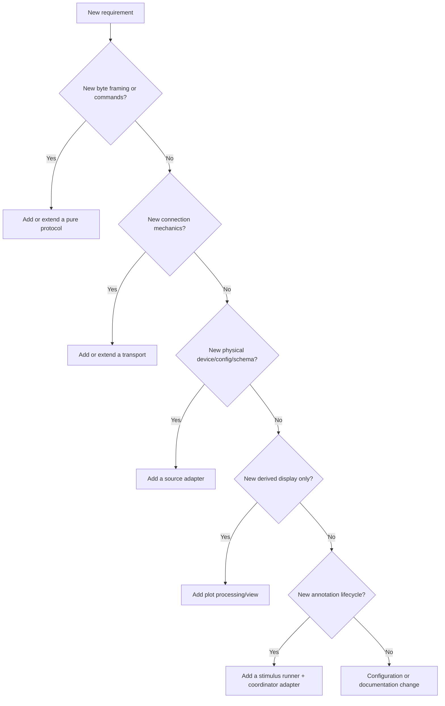

# 09 — Extension Playbooks

These playbooks describe the smallest safe change for common extensions. They
preserve the current architecture instead of requiring a redesign for every
new device or experiment.

## First decide what is actually new

A protocol can be reused by Serial and BLE. A transport can carry multiple
protocols. A source is the adapter that combines one device configuration,
transport choice, protocol parser, timestamp policy, and `StreamSpec`.

## Add a protocol over an existing transport

Use this when bytes, commands, checksum, or packet fields are new but Serial or
BLE connection behavior is already available.

1. Add a module under `DeviceInterface/`.
2. Keep it deterministic and independent of threads, queues, time, GUI, and
   filesystem.
3. Represent decoded output with frozen dataclasses or simple immutable values.
4. Implement incremental `feed(bytes)` parsing when transport callbacks may
   split, merge, or misalign frames.
5. Track resynchronization/checksum/error diagnostics when the protocol allows.
6. Write parser tests for:
   - one valid frame;
   - split frame;
   - merged frames;
   - leading junk/misalignment;
   - bad checksum/tail/length;
   - recovery to the next valid frame;
   - numeric sign, endianness, and scaling boundaries.
7. Add a source adapter that maps decoded packets to rows. Do not expose packet
   objects directly to `CaptureStore` or Plot.

Do not place BLE UUIDs or COM ports in a pure parser unless the protocol itself
defines them. Connection identifiers belong to source/transport config.

## Add a transport for an existing protocol

Use this when the device protocol stays identical but bytes arrive through a
new interface such as TCP, USB HID, or another BLE service pattern.

1. Define a small transport config dataclass with normalization.
2. Implement only connection mechanics: open/connect, read or notify, write,
   disconnect, and connection status.
3. Keep protocol start/stop command bytes in the protocol/source layer.
4. Inject the transport into the worker so tests can use a fake transport.
5. Reuse the same parser and packet-to-row adapter used by existing interfaces.
6. Add transport tests for cancellation, timeout, disconnect callback, repeated
   cleanup, and partial reads/notifications.
7. Expose the interface choice per physical device when mixed interfaces must
   coexist, as W2 does with `W2DeviceConfig.transport`.

Before generalizing `SerialByteTransport` or `BleGattTransport`, confirm the
new interface needs the same semantics. A broad base class is less useful than
a small structural protocol plus focused implementations.

## Add a new acquisition source

### 1. Define identity and configuration

- Add a unique source name and display name.
- Use frozen config dataclasses with a `normalized()` method.
- Separate deployment defaults (address/port/name) from protocol defaults
  (UUID/frame/rate) where practical.
- Validate empty targets, duplicate device IDs, ports, addresses, and maximum
  device count in `AcquisitionController` or a source-owned validator.

### 2. Declare streams first

For every independently sampled table, create one `StreamSpec`:

- stable unique `stream_id`;
- human-readable `display_name`;
- nominal rate or `None` when unknown;
- explicit `time_source` description;
- ordered `FieldSpec` values with stable keys, roles, units, signal kinds, plot
  hints, and formatting.

Do not combine asynchronous EMG/IMU callbacks into a sparse or duplicated row.
Do not use the transport name in stream identity if switching transport should
still represent the same logical channel.

### 3. Implement the worker

The worker should:

- own its connection and decoder;
- publish `StreamBlock` batches to `data_queue`;
- publish `WorkerEvent` health/ready/error/metadata messages to `event_queue`;
- stop when `stop_event` is set;
- flush pending complete rows before shutdown;
- restore timestamp/counter continuity from `CaptureResumeState`;
- never mutate `CaptureStore` directly.

For coordinated sources, accept a shared `WorkerControl`, expose
`ready_event`, and set `supports_managed_lifecycle = True`. Decide explicitly
what Pause means for the hardware and whether notifications/ports remain open.

### 4. Register and configure

- Add the source to `fundamental/sources/__init__.py` exports where applicable.
- Construct it in `AcquisitionController.__init__()` and include it in the
  source registry and `SourceName` typing.
- Extend `source_config.py` only for source-specific fields; keep lifecycle
  buttons in Acquisition.
- Add capture metadata that records normalized config, transport, timestamp
  meaning, and relevant device identity.
- Ensure active stream IDs are globally unique when combined with other
  sources.

### 5. Test the boundary

At minimum test config normalization, stream schema, packet-to-row mapping,
resume timestamps, Pause semantics, cleanup, error events, and multi-device
uniqueness. Add one `AcquisitionController` test proving the source participates
in the intended lifecycle combination.

## Add a field or change a stream schema

Treat field keys and stream IDs as persisted API. Offline scripts may depend on
them.

1. Change the source's `StreamSpec` and row builder together.
2. Put identifiers/counters/status in metadata-role fields and physical signals
   in signal-role fields.
3. Assign a correct unit and `signal_kind`.
4. Decide whether it is plottable and whether it should be a default plot.
5. Update parser/source tests, capture-store tests, output header expectations,
   and this wiki.
6. If compatibility is required, add a schema/version field to metadata before
   renaming an existing key. Do not silently reuse a key with new units.

The CSV writer requires no device branch; it follows the schema automatically.

## Add a display transform or specialized visualization

### Scalar transform

1. Add a pure function to `plot_processing.py`.
2. Make it explicit which `signal_kind` supports the transform.
3. Keep raw values unchanged in `CaptureStore`.
4. Test numerical behavior and units.
5. Add the option through `SeriesSpec.view_options` or a future view-policy
   registry rather than device-name checks.

### Specialized IMU/3D view

1. Read required series by stable series IDs or semantic field metadata.
2. Keep the view read-only; it must not own source lifecycle.
3. Handle absent/partial axes and asynchronous streams.
4. Use recent `SeriesWindow` data or a dedicated read-only provider contract.
5. Add a new registered window/command instead of embedding 3D logic into the
   generic plot window.

Never write transformed values back into raw capture rows.

## Add a stimulus paradigm

First classify it:

- A fixed duration sequence may be compiled to `StimulusEvent` values and use
  `StimulusController`.
- A manual interval labeler should follow `MIILController` and receive
  `CapturePosition` boundaries.
- An operator-paced ordering layer can remain a pure planner like
  `GuidedSequenceController` and return commands for `RecordingSession` to
  apply.
- Randomized, branching, response-driven, or media-presenting paradigms should
  introduce a small runner interface instead of adding another branch to every
  existing controller method.

Required design questions:

1. Is it annotation only, or must it present visual/audio/hardware stimuli?
2. What starts and ends an interval: capture time, operator input, subject
   response, or external trigger?
3. What does Pause do to the current trial?
4. What should happen when the paradigm completes: Pause, Stop, or continue a
   post-baseline?
5. Is a single integer `stimulus_code` sufficient for each sensor row?
6. What trial/block/response metadata must be preserved in JSON/sidecar?
7. What onset precision is required? GUI actions do not provide hardware-trigger
   precision.

Implementation rules:

- Keep the runner independent of devices and file I/O.
- Route cross-domain effects through `RecordingSession`.
- Freeze the applied definition/plan for each capture.
- Save the definition version, actual attempts, outcomes, and boundary data.
- Preserve one scalar `stimulus_code` in raw sensor CSV for compatibility;
  place richer structure in metadata and the event sidecar.
- Add tests for Start readiness, Pause/Resume, Stop/failure, completion policy,
  partial save, invalid attempts, and sample/row boundary labeling.

## Add configuration persistence

Configuration is currently process-local. A future persistence feature should
not serialize Dear PyGui widget state directly.

1. Define a versioned application profile composed of normalized source and
   paradigm config dataclasses.
2. Keep secrets and transient runtime state out of the profile.
3. Validate and migrate loaded versions before applying them.
4. Apply only while acquisition is stopped.
5. Keep capture metadata as a frozen copy of the applied normalized config.
6. Provide explicit Load/Save/Reset actions and visible validation errors.
7. Test round-trip, unknown fields, missing fields, version migration, invalid
   port/address, and atomic write behavior.

Do not let loading a profile silently erase a capture already buffered in
memory.

## Extend capture metadata or sidecar rows

- Source/runtime facts go under source or runtime metadata.
- Stream schema and file/row counts remain generated by `csv_writer`.
- Paradigm definition and run state go under `metadata["stimulus"]`.
- Per-event scalar audit fields may extend `capture.stimulus.csv`.
- Nested values belong in JSON; the sidecar intentionally omits non-scalar
  extras.

Additive fields are preferred. If meaning changes, introduce an explicit
format/schema version before downstream consumers depend on the old meaning.

## Pre-merge checklist for any extension

- [ ] Boundary is chosen correctly: protocol, transport, source, coordinator,
      view, or paradigm.
- [ ] Raw values and timestamp meaning are documented.
- [ ] No device-specific branch was added to generic plot or CSV code.
- [ ] Source and paradigm config cannot change during active acquisition.
- [ ] Stream IDs and field keys are stable and unique.
- [ ] Pause/Resume and failure cleanup are tested.
- [ ] Saved metadata is sufficient to reproduce interpretation.
- [ ] Relevant unit tests and full test discovery pass.
- [ ] Hardware smoke test is recorded when hardware behavior changed.
- [ ] Development Wiki/manual/engineering note is updated at the appropriate
      level.
