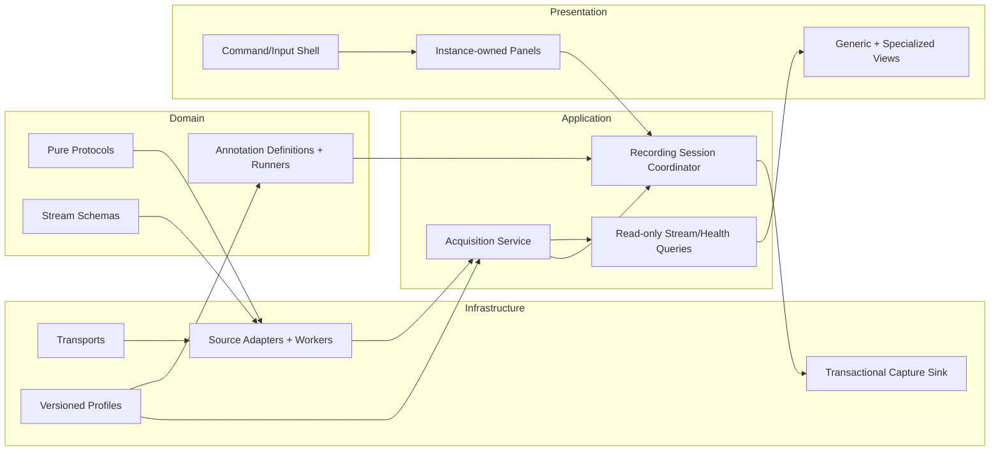

# 10 — Refactoring Guide

This chapter is for architecture work that should preserve current experiment
behavior. It distinguishes stable contracts from implementation debt and gives
a staged path that can be stopped after any phase.

## Refactoring principle

Refactor from characterized behavior, not from an imagined clean slate. Raw
capture interpretation and operator lifecycle semantics are more important
than class shape. First add fixtures/tests for the behavior being moved; then
extract one boundary without changing file schemas, timestamps, or controls.

## Invariants that must survive

### Acquisition and devices

- `AcquisitionController` remains the single physical lifecycle owner.
- Start/Pause/Resume/Stop apply to the full active capture set.
- Managed multi-device Start waits for every required worker to become ready.
- A required worker error fails the capture set instead of silently continuing
  with missing channels.
- Pause does not disconnect managed W2/BWT901 devices and does not add paused
  wall time to the shared logical clock.
- Stop performs final cleanup and drains complete queued blocks.
- Source config and active stream schema cannot change during an active or
  paused capture.

### Data evidence

- Raw decoded values are saved without plot/analysis transforms.
- Independently sampled streams remain independent and may have different row
  counts and endpoints.
- Within each stream, time is monotonic and its source/meaning is recorded.
- Stream IDs, field keys, units, and metadata meaning are persisted API.
- No refactor may silently pad, truncate, interpolate, or align raw streams.
- One experiment directory contains the files for one capture.

### Annotation

- Stimulus never opens or closes device connections directly.
- The applied paradigm/codebook/plan is frozen for the current capture.
- MIIL saves boundaries in both shared capture time and per-stream row space.
- `drop_stimulus` invalidates the complete current MIIL interval with code `-1`.
- Pause freezes the current MIIL action and elapsed time without splitting the
  interval; Resume continues it.
- Guided Drop does not consume a planned step; completion requests a global
  Pause and cannot be resumed as an unfinished plan.
- Sensor CSV keeps a single integer `stimulus_code`; richer structure belongs
  in JSON and the event sidecar.

### UI and operation

- Plot is a read-only consumer and never controls acquisition connections.
- Command Palette and focused editors take priority over context Enter.
- One physical Enter press produces at most one Guided advance.
- Unsafe/unapplied MIIL or Guided edits block Start visibly.

## Current strengths worth retaining

- `DeviceInterface` parsers are pure and hardware-independent.
- Serial/BLE mechanics are separated from W2/BWT901 packet decoding.
- Sources publish generic `StreamSpec`/`StreamBlock` contracts.
- Plot and CSV are schema-driven rather than device-driven.
- Shared W2/BWT901 lifecycle uses a readiness barrier and fail-fast policy.
- `MIILController` and `GuidedSequenceController` hold domain behavior outside
  Dear PyGui.
- Persistence receives label resolvers and metadata rather than importing a
  stimulus controller.
- Tests cover protocol, source, stream, session, state model, and headless UI
  boundaries independently.

## Technical debt register

### 1. `RecordingSession` contains paradigm dispatch

`RecordingSession` is the correct coordination boundary, but it currently has
explicit Timed/MIIL/Guided branches in start, pause, resume, stop, failure, and
save paths. A fourth substantially different paradigm would multiply these
branches.

Direction: keep the session as coordinator, but introduce a small annotation
adapter/runner contract and an explicit completion policy (`none`, `pause`, or
`stop`). Do not make acquisition depend on that contract.

### 2. `stimulus_window.py` is a large module-level UI singleton

Timed editing, MIIL action configuration, Guided planning, operator status,
history, lifecycle buttons, and save path are in one module with module-level
tags and signature caches. This works for one application/session, but makes
view testing and reuse fragile.

Direction: split instance-owned panels behind a shared toolbar/view model:

```text
StimulusWindow
├── LifecycleToolbar
├── TimedSchedulePanel
├── MIILActionPanel
├── GuidedSequencePanel
└── OperatorConsole
```

Move one panel at a time while keeping existing tags/callback behavior covered
by headless tests.

### 3. Configuration is hardcoded and process-local

Deployment-specific W2 ports, names, and BWT address live beside source code.
UI edits disappear on process exit. This encourages source edits for experiment
setup and makes metadata reproducibility depend on remembering the code commit.

Direction: add a versioned profile model and explicit load/save. Keep source
dataclasses as normalized runtime config and freeze the applied profile into
capture metadata. Do not serialize widget internals.

### 4. Full capture is retained in Python objects

`CaptureStore` keeps every timestamp and row in lists while also keeping bounded
plot deques. Five 1 kHz W2 devices for ten minutes produce roughly three million
W2 rows before IMU data; tuple/list/object overhead can be much larger than the
raw numeric payload.

Direction: introduce a capture sink/chunk writer with bounded memory while
preserving a read-only recent-window provider for Plot. Design crash recovery,
checkpoint semantics, and metadata finalization before replacing the current
snapshot writer.

### 5. Multi-file save is not transactional

Files are written directly one after another. A disk/permission/process failure
can leave a partial mix, and a Guided checkpoint to the same base path rewrites
current files.

Direction: write to a temporary experiment staging area, fsync/close, write a
manifest with schema version and completeness, then atomically rename/commit
where the platform permits. Preserve current filenames and CSV columns for
downstream compatibility.

### 6. Timestamp semantics are intentionally heterogeneous

- ADS1299: device counter at nominal rate;
- W2: configured rate anchored at first packet to shared host clock;
- BWT901: shared host receive time, output rate unknown;
- Myo: per-stream nominal reconstruction plus host callback audit.

Timed Schedule still follows `CaptureStore.latest_time_s`, while MIIL uses the
shared managed clock plus row cursors. This is documented behavior, not a bug,
but generic naming can hide the distinction.

Direction: introduce an explicit `CapturePosition`/time-domain service carrying
`timeline_time_s`, `sample_time_s`, and row cursors. Never relabel host receive
time as device time. Hardware synchronization requires device/trigger support,
not merely a software refactor.

### 7. Queue and backpressure policy is implicit

Worker queues are unbounded. The UI frame loop drains a limited number of data
batches, while boundary capture uses a snapshot of the queued batch count.
Heavy UI stalls can increase memory and labeling latency.

Direction: measure queue depth and drain latency first. Add telemetry and
explicit overflow/backpressure policy before bounding queues; dropping blocks
without recording a gap would be worse than high memory usage.

### 8. Errors and health are mostly strings/dictionaries

String return values are convenient for UI logs but difficult for programmatic
recovery or structured presentation. Health dictionaries have an implicit
schema.

Direction: introduce typed result/error/health records at subsystem boundaries,
then format them in UI. Retain useful human messages and serialized failure
metadata.

### 9. Save path exists in two UI modules

Acquisition and Stimulus windows each mirror a save-path input. Their values are
synced opportunistically, so simultaneous edits can diverge.

Direction: make the session/controller own one path value and bind both views
to it, or expose one shared path widget model.

### 10. Source registration and typing are static

The source registry is constructed directly and `SourceName` is a closed type.
Adding a source changes controller composition and UI selection code.

Direction: use explicit source descriptors/registry after the source contract
is fully characterized. Avoid a dynamic plugin system until config/schema and
lifecycle capabilities have clear validation rules.

### 11. Metadata lacks a top-level schema version

The metadata is descriptive and additive, but downstream compatibility cannot
be checked reliably without a version and golden fixtures.

Direction: version capture metadata and stimulus sidecar schema before making
breaking field changes. Keep raw file schema discoverable from `streams`.

### 12. Hardware behavior is not exercised in CI

Tests use parsers, fakes, fake transports, and headless Dear PyGui contexts.
That is appropriate for deterministic CI, but cannot validate Bluetooth stack,
Serial driver, physical keyboard focus, device command latency, or multi-device
queue tails.

Direction: retain fast tests and add a documented, optional hardware acceptance
suite that records device IDs, firmware, duration, failures, row counts, rates,
and capture artifacts.

## Extraction map

| Candidate | Current coupling | Extraction readiness |
| --- | --- | --- |
| `DeviceInterface/*_protocol.py` | Pure Python values/bytes | High; extract with parser tests |
| `streams.py` | No GUI/hardware | High; defines core data API |
| `guided_sequence.py` | Pure state machine | High; retain command/effect boundary |
| `miil_model.py` | Depends only on stimulus constants | High after moving shared code constants |
| `transports.py` | `bleak`/`pyserial` runtime dependencies | Medium; formalize injected backend contract |
| `capture_store.py` | In-memory implementation of stream provider | Medium; separate interfaces before extraction |
| `csv_writer.py` | Filesystem and current metadata shape | Medium; version/atomicity first |
| source modules | Config, worker, protocol, transport, metadata | Medium; split adapter from thread runner if reused |
| `RecordingSession` | Concrete acquisition/paradigm methods | Low until annotation adapter contract exists |
| Dear PyGui windows | Module globals and controller internals | Low; introduce presenters/view models incrementally |

## Staged refactoring roadmap

### Phase 0 — Characterize and version

Goal: make current behavior safe to move.

- Add golden metadata/CSV/sidecar fixtures for ADS1299, five W2 + BWT901, Timed,
  MIIL manual, Guided completed, Guided partial, and Guided dropped/retried.
- Add metadata/schema version fields without changing existing columns.
- Record representative hardware acceptance captures.
- Add queue-depth and memory measurements for a ten-minute maximum experiment.

Exit criterion: a compatibility test can identify an unintended data-contract
change.

### Phase 1 — Define narrow interfaces

Goal: name existing boundaries, not redesign behavior.

- Read-only `StreamCatalog`/`RecentSeriesProvider` for Plot.
- `CaptureSink`/`CaptureSnapshotProvider` separation for persistence.
- Typed `SourceDescriptor`, `SourceHealth`, and error result.
- `AnnotationRunnerAdapter` and `AnnotationSavePayload` with mutually exclusive
  time-based and row-based resolvers.
- Explicit completion policy owned by the annotation adapter.

Exit criterion: existing classes satisfy the interfaces through adapters and
all tests pass unchanged.

### Phase 2 — Split stimulus UI

Goal: remove the largest GUI coupling without changing experiment semantics.

- Extract instance-owned panel classes and a pure operator-console view model.
- Keep session commands as the only mutation API.
- Replace direct controller-internal reads with immutable view data.
- Provide a public test harness rather than setting private capture fields.

Exit criterion: existing window tests cover the same controls with no module
singleton state.

### Phase 3 — Versioned configuration profiles

Goal: stop editing source files for routine hardware setup.

- Add application profile dataclasses and JSON load/save/migration.
- Separate protocol defaults from local deployment profiles.
- Store applied profile and app commit/version in capture metadata.
- Keep changes blocked outside STOPPED state.

Exit criterion: restart the app, load a profile, and reproduce the same source
schemas/config metadata without code changes.

### Phase 4 — Transactional streaming persistence

Goal: bound memory and improve crash safety.

- Append immutable chunks to a staging capture.
- Keep plot windows bounded independently.
- Finalize metadata/manifest transactionally on Save/Stop.
- Define checkpoint vs final capture semantics and recovery tooling.
- Preserve current CSV export as a compatibility/export path if the internal
  chunk format changes.

Exit criterion: maximum-duration hardware capture stays within a measured
memory budget and an interrupted save is detectably incomplete/recoverable.

### Phase 5 — Time-domain and synchronization services

Goal: make current timing semantics explicit and support better diagnostics.

- Carry clock source/uncertainty/counter continuity with stream metadata.
- Report start/end, observed rate, drift estimate, and gaps per stream.
- Provide an offline common-overlap/resampling export with explicit parameters.
- Add hardware-trigger integration only when supported by devices/firmware.

Exit criterion: analysis can distinguish logical coordination from hardware
synchronization and reproduce every derived alignment.

### Phase 6 — Registry-driven extensibility

Goal: make additional sources/paradigms routine after contracts are stable.

- Register source descriptors, config editors, and capability declarations.
- Register annotation adapters and their editor/operator panels.
- Validate compatible source combinations and completion policies centrally.

Exit criterion: a new source or paradigm can be added without modifying generic
plot/persistence or every lifecycle branch.

## Possible target architecture

This is a direction, not a requirement for a single rewrite:



The dependency direction remains inward toward domain contracts. Dear PyGui,
Serial/BLE libraries, and filesystem implementations stay replaceable at the
outside.

## How to review a refactor PR

1. Identify exactly which boundary moved.
2. List invariants affected and the characterization tests proving them.
3. Compare a representative capture before/after: stream IDs, headers, values,
   time endpoints, row counts, metadata, and stimulus labels.
4. Confirm no new reverse dependency was introduced.
5. Confirm Pause/Resume/Stop/failure cleanup and a new experiment after Stop.
6. Run unit, headless UI, full discovery, and relevant hardware acceptance.
7. Update this wiki when ownership or a stable contract changes.

Avoid a big-bang rewrite of sources, session, UI, and persistence together. The
current boundaries are strong enough to improve one subsystem at a time.
